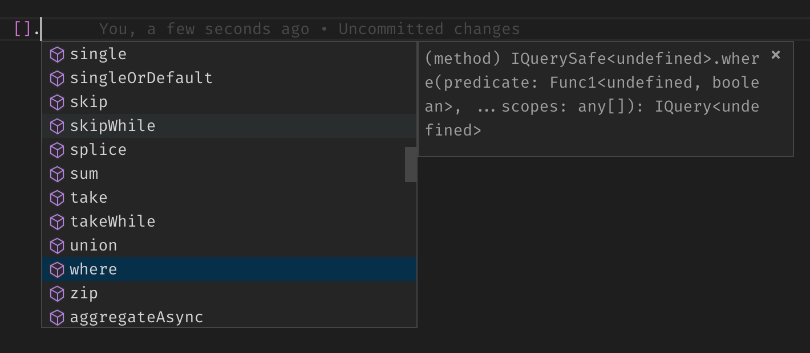

JavaScript ile Linq yazı serimizin sekizincisine hoş geldiniz.

1. [Linq gerçekte nedir?](/javascript-linq-01)
2. [Expression'lar](/javascript-linq-02)
3. [ExpressionVisitor sınıfı](/javascript-linq-03)
4. [IQueryable ve IQueryProvider](/javascript-linq-03)
5. [Jokenizer - JavaScript Expression'larını parse edelim](/javascript-linq-05)
6. [Jokenizer.Net - C# Expression'larını parse edelim](/javascript-linq-06)
7. [DynamicQueryable - Dinamik sorgu oluşturalım](/javascript-linq-07)
8. Jinqu - JavaScript ile Linq  **(You are here)**
9. [Linquest ve Linquest.AspNetCore - Asp.Net Core ile cevap verelim](/javascript-linq-09)

Bu yazıda [jinqu](https://github.com/jin-qu/jinqu) projesi ile JavaScript'e Linq yeteneği kazandıracağız.

Geldiğimiz noktada JavaScript ve C# ile yazılan ifadeleri parse edip yorumlayabilir durumdayız, C# ile bu ifadeleri IQueryable üzerine yansıtıp sorgularımızı da dinamik oluşturabiliyoruz. Tekrar istemci tarafına dönelim, C# ile Linq nasıl yapılmışsa olabildiğince benzer bir yöntem ile JavaScript için gerçekleştirelim. İlk olarak Linq-to-Objects yani diziler üzerinde sorgu çalıştırabilmemizi sağlayan geliştirmeleri yapalım. Bunu öyle bir yapalım ki, sorgularımızı sunuculara gönderebilmemiz için güzel bir altyapı sağlasın.

Hemen proje yapımıza bakarak başlayalım:


# ./types.ts

İlk ele almamız gereken dosya **type.ts**. C# için Linq'dan bahsederken IQueryable ve IQueryProvider interface'lerinden bahsetmiştik. Olabildiğince yakın yapmaya çalışacağımdan bahsetmiştim, işte **IQueryProvider**.

```typescript
export interface IQueryProvider {
    createQuery(parts?: IQueryPart[]): IQueryBase;
    execute<TResult = any[]>(parts: IQueryPart[]): TResult;
    executeAsync<TResult = any[]>(parts: IQueryPart[]): PromiseLike<TResult>;
}
```

şimdi bir de C# nasıl yapmış onu görelim:

```csharp
public interface IQueryProvider{
    IQueryable CreateQuery(Expression expression);
    IQueryable<TElement> CreateQuery<TElement>(Expression expression);

    object Execute(Expression expression);
    TResult Execute<TResult>(Expression expression);
}
```

Neredeyse aynı olduğunu görebilirsiniz, sadece asenkron desteğini sonradan eklemek yerine en alt seviyede ekledim.

Expression yerine kullandığımız **QueryPart** nedir merak ettiyseniz:

```typescript
export interface IQueryPart {
    readonly type: string;
    readonly args: IPartArgument[];
    readonly scopes: any[];
}
```

Bunu biraz açıklamak gerekecek. C# aşağıdaki metot zinciri çağrılarını her zaman tek bir Expression olarak tutuyor, aşağıdaki gibi:

```csharp
query.Where(c => c.Id > 5).OrderBy(c => c.Name);
```

bu çağrıların sonucu aşağıdakine benzer bir şekilde tutulur:

```json
{
    "NodeType": "Call",
    "Method": "OrderBy",
    "Body": "c => c.Name",
    "Parameters": {
        "NodeType": "Call",
        "Method": "Where",
        "Body": "c => c.Id > 5"
    }
}
```

Gördüğünüz gibi, **Where** çağrısı sonucunu **OrderBy** çağrısının bir parametresi olarak Expression'a ekliyor. Bunu uygulamayı değerlendirdiğimde daha basit bir yöntemi tercih ettim, çünkü amacım birebir C# ile aynı olan bir çözümden ziyade, bir liste üzerinde yapılan sorgulama ifadelerini değerlendirebilmek gibi daha küçük kapsamlı bir ihtiyaca çözüm bulmak idi.

Benim yaklaşımımda ise, her bir çağrı ayrı bir **IQueryPart** ve sorgu içinde tuttuğum obje içiçe çağrıları temsil eden bir Expression yerine **IQueryPart** dizisi. Böylece sorgu oluştururken aldığımız parametre **Expression** yerine **IQueryPart[]** oluyor.

Sıradaki tipimiz ise **IQueryBase**.

```typescript
export interface IQueryBase {
    readonly provider: IQueryProvider;
    readonly parts: IQueryPart[];
}
```

C# ile karşılaştıralım:

```csharp
 public interface IQueryable : IEnumerable {
    Expression Expression { get; }
    Type ElementType { get; }
    IQueryProvider Provider { get; }
}
```

> typescript ile C#'da olduğu gibi generic parametreleri farklı aynı isimli tip oluşturamıyoruz. O yüzden farklı bir isim verdim.

**IQuery** tipimizi diziler ile kullanabilmek için **Array** tipine **IQuery** tipindeki metotları ekleyeceğiz. Ancak bu metotlardan bazıları zaten **Array** üzerinde bulunmakta.

```typescript
interface IQueryDuplicates<T> {
    concat(other: Array<T>): IQuery<T>;
    join<TOther, TResult = any, TKey = any>(other: Array<TOther>, thisKey: Func1<T, TKey>, otherKey: Func1<TOther, TKey>,
        selector: Func2<T, TOther, TResult>, ...scopes): IQuery<TResult>;
    reverse(): IQuery<T>;
}
```

Çakışan metotları ayrı bir tip üzerinde topladım, birazdan bunu neden yaptığımız daha iyi anlaşılacak.

Diğer metotları ise **IQuerySafe** interface'inde topluyoruz.

```typescript
export interface IQuerySafe<T> extends IQueryBase, Iterable<T> {
    aggregate<TAccumulate = number>(func: Func2<TAccumulate, T, TAccumulate>, seed?: TAccumulate, ...scopes): TAccumulate;
    aggregateAsync<TAccumulate = number>(func: Func2<TAccumulate, T, TAccumulate>, seed?: TAccumulate, ...scopes): PromiseLike<TAccumulate>;
    all(predicate: Predicate<T>, ...scopes): boolean;
    allAsync(predicate: Predicate<T>, ...scopes): PromiseLike<boolean>;
    any(predicate?: Predicate<T>, ...scopes): boolean;
    anyAsync(predicate?: Predicate<T>, ...scopes): PromiseLike<boolean>;
    // ... tamamı için github üzerindeki kodlara bakabilirsiniz

    toArray(): Array<T> & InlineCountInfo;
    toArrayAsync(): PromiseLike<Array<T> & InlineCountInfo>;
}
```

Son olarak **IQuery** tipimizi oluşturuyoruz.

```typescript
export type IQuery<T> = IQuerySafe<T> & IQueryDuplicates<T>;
```

**IQuery**, **IQuerySafe** ve **IQueryDuplicates** tiplerinin birleşiminden oluşuyor.

Linq ile çalışırken farketmişsinizdir, **ThenBy** metodunu kullanabilmek için öncelikle **OrderBy** ya da **OrderByDescending** çağrısı yapılmış olması gerekiyor. Aynı durumu JavaScript için aşağıdaki gibi oluşturabiliriz.

```typescript
export interface IOrderedQuery<T> extends IQuery<T> {
    thenBy(selector: Func1<T>, ...scopes): IOrderedQuery<T>;
    thenByDescending(keySelector: Func1<T>, ...scopes): IOrderedQuery<T>;
}
```

Bunu [C# nasıl yapmış](https://referencesource.microsoft.com/#system.core/System/Linq/IQueryable.cs,379) derseniz:

```csharp
public static IOrderedQueryable<TSource> OrderBy<TSource, TKey>(this IQueryable<TSource> source, Expression<Func<TSource, TKey>> keySelector, IComparer<TKey> comparer) {
    if (source == null)
        throw Error.ArgumentNull("source");
    if (keySelector == null)
        throw Error.ArgumentNull("keySelector");
    return (IOrderedQueryable<TSource>) source.Provider.CreateQuery<TSource>(
        Expression.Call(
            null,
            GetMethodInfo(Queryable.OrderBy, source, keySelector, comparer),
            new Expression[] { source.Expression, Expression.Quote(keySelector), Expression.Constant(comparer, typeof(IComparer<TKey>)) }
        )
    );
}
```

**OrderBy** ve **OrderByDescending** metotları **IQueryable** yerine **IOrderedQueryable** tipini dönüyor.

```csharp
public static IOrderedQueryable<TSource> ThenBy<TSource, TKey>(this IOrderedQueryable<TSource> source, Expression<Func<TSource, TKey>> keySelector) {
            if (source == null)
                throw Error.ArgumentNull("source");
            if (keySelector == null)
                throw Error.ArgumentNull("keySelector");
            return (IOrderedQueryable<TSource>) source.Provider.CreateQuery<TSource>(
                Expression.Call(
                    null,
                    GetMethodInfo(Queryable.ThenBy, source, keySelector),
                    new Expression[] { source.Expression, Expression.Quote(keySelector) }
                )
            );
        }
```

**ThenBy** ve **ThenByDescending** extension metotlarını da **IOrderedQueryable** tipi için yazarak sadece önceden sıralanmış sorgular için **ThenBy** ve **ThenByDescending** çağrısı yapılabilir kılınıyor.

# ./queryable.ts

Interface tanımlarımızı gördükten sonra sorgu sınıfımızı yazma vakti. Bu dosyada tek bir sınıfımız olacak, **Query**. Tanım aşağıdaki gibi:

```typescript
export class Query<T = any> implements IOrderedQuery<T>, Iterable<T> {
        constructor(public readonly provider: IQueryProvider, public readonly parts: IQueryPart[] = []) {
    }
    // ...
}
```

Biraz önce tanımladığımız **IOrderedQuery** ve yeni JavaScript özelliği olan **Iterable** interface'lerini implemente edeceğiz. Constructor ise **IQueryBase** ile tanımladığımız **provider** ve **parts** bilgilerini parametre alıyor.

Birkaç metot ile implementation işini nasıl yaptığımızı görelim, tüm kod yine burada paylaşmak için çok uzun ama mantığı kavramamıza yetecektir.

```typescript

// senkron sonuç dönen metotlara bir örnek
// provider üzerinden varolan QueryPart'lara any part'ı eklenerek çağırılıyor
// part'ları birazdan detaylı göreceğiz
any(predicate?: Predicate<T>, ...scopes): boolean {
    return this.provider.execute([...this.parts, QueryPart.any(predicate, scopes)]);
}

// asenkron sonuç dönen metotlara bir örnek
// aynı işi provider'ın executeAsync metodunu çağırarak yapıyor
anyAsync(predicate?: Predicate<T>, ...scopes): PromiseLike<boolean> {
    return this.provider.executeAsync([...this.parts, QueryPart.any(predicate, scopes)]);
}

// metot zinciri yapan (yani sonuç değil yine sorgu dönen) bir örnek
// create metodunu where part'ı ile çağırıyor
where(predicate: Predicate<T>, ...scopes): IQuery<T> {
    return this.create(QueryPart.where(predicate, scopes));
}

// create yardımcı metodumuz
// sorgu üzerine yapılan her işlem yeni bir part olarak part listesinin sonuna ekleniyor
protected create<TResult = T>(part: IQueryPart): IQuery<TResult> {
    return <any>this.provider.createQuery([...this.parts, part]);
}

```

Bunlar bizim metotlarımız, **Iterable** için ise aşağıdaki sembol indexer'ını yazmamız gerekiyor. [Iterator ve Generator](https://developer.mozilla.org/en-US/docs/Web/JavaScript/Guide/Iterators_and_Generators) konusunu kesinlikle okumanızı tavsiye ederim.

```typescript
// sorgumuzda şu ana kadar eklenmiş tüm part'ları senkron bir şekilde çalıştırıyoruz
// birazdan QueryProvider'ın nasıl çalıştığını incelediğimizde daha iyi anlaşılacaktır
[Symbol.iterator]() {
    return this.provider.execute<IterableIterator<T>>(this.parts);
}
```

Sorgu sınıfımızı şöyle özetleyebiliriz:

* Sonuç dönen metotlar (**first**, **all** vb..) provider üzerinden çalıştırılır
* Sorguyu genişleten metotlar (**where**, **orderBy** vb..) sorgunun part listesine kendilerini ekleyip yeni bir sorgu oluştururlar

Bir de bilmeyenler, bu üç nokta nedir diyenler için ufak bir açıklama yapalım.

## [Destructuring](https://developer.mozilla.org/en-US/docs/Web/JavaScript/Reference/Operators/Destructuring_assignment)

Dizileri açmamızı sağlayan "**...**" yeni bir özellik.

Değişkenleri dağıtırken kullanabiliriz:

```JavaScript
const foo = ['one', 'two', 'three'];
const [one, two, three] = foo;

console.log(one); // "one"
console.log(two); // "two"
console.log(three); // "three"
```

Yukarıda 3 değişkene sırayla değer atadık.

Bizim kullanımımız ise aşağıdaki gibi:

```typescript
[...this.parts, part]
```

**parts** dizisindeki tüm içeriğin sonuna **part** değişkeni eklenmiş yeni bir dizi oluşturduk.

# ./query-part.ts

Sürekli bahsettiğimiz **QueryPart** detayına girmeden öncelikle **PartArgument** ne imiş görelim.

**PartArgument** **where** gibi metotlara geçtiğimiz her bir parametreyi temsil ediyor.

Sorgularımızda da fonksiyonların yanında fonksiyonu temsil eden string ifadeleri de kullanabildiğimizi biliyorsunuz ([jokenizer sağolsun](/javascript-linq-05)).

Sınıf aşağıdaki gibi:

```typescript
export class PartArgument implements IPartArgument {

    constructor(identifier: Function | string, literal, scopes: any[]) {
        if (typeof identifier === 'string') {
            this._expStr = identifier;
        }
        else {
            this._func = identifier;
        }
        this._literal = literal;
        this._scopes = scopes;
    }
    // ...
}
```

Parametre olarak bir foksiyon ya da string, bir sabit değer ve scope listesi alıyor.

Sabit değere bir örnek:

```typescript
// buradaki 10 sayısı bir sabit
query.take(10)
// yapılan çağrı "new PartArgument(null, 10, null)"
```

Fonksiyon ya da string ve scope listesi için bir örnek:

```typescript
// bir fonksiyon geçtik, scope olarak da id değerini içeren bir obje geçtik
query.where(c => c.id != id, { id: 5 });
// bir fonksiyonu string olarak geçtik, bu fonksiyon parse edilerek değerlendirilecek
// scope olarak da id değerini içeren bir obje geçtik
query.where('c => c.id != id', { id: 5 });
// yapılan çağrı "new PartArgument(exp, null, null)"
```

Kolay çalışmayı sağlamak adına birkaç özellik ekledim, her seferinde **string** değerden **expression** üretmek bu yapıyı dışarıdan kullanırken gerekmemeli.

```typescript
private _func: Function;
get func() {
    if (this._func) return this._func;
    if (!this._expStr) return null;

    if (this.exp.type === ExpressionType.Func) {
        const f = evaluate(this.exp, ...this._scopes);
        return this._func = (...args) => f.apply(null, args);
    }

    return this._func = (...args) => evaluate(this.exp, ...args.concat(this._scopes));
}

private _expStr;
get expStr() {
    if (this._expStr) return this._expStr;
    if (!this._func) return null;

    return this._expStr = this._func.toString();
}

private _exp: Expression;
get exp() {
    if (this._exp) return this._exp;

    const s = this.expStr;
    if (!s) return null;

    return this._exp = tokenize(s);
}

private _literal;
get literal() {
    return this._literal;
}
```

Tüm büyü yukarıdaki satırlarda. Senaryoları düşünelim:

* Expression istenirse
  * Fonksiyon gönderilmemiş ise **null** dönülür (bu PartArgument bir sabittir)
  * Fonksiyon üzerinde **toString** çağrılır
  * String değer **tokenize** ile parse edilir
* Fonksiyon istenirse
  * String gönderilmemiş ise **null** dönülür (bu PartArgument bir sabittir)
  * Expression istenir ve **string** değer parse edilerek dönülür

Her zaman olduğu gibi kodları incelemenizi tavsiye ederim :)

Parametrelerimizi temsil eden yapımızın yanında hangi metota çağrı yapıldığını da tutan bir yapıya ihtiyacımız var, o da **QueryPart**.

```typescript
export class QueryPart implements IQueryPart {

    constructor(type: string, args: IPartArgument[] = [], scopes: any[] = []) {
        if (!type) throw new Error('Type of QueryPart cannot be null or empty.');

        this._type = type;
        this._args = args;
        this._type = type;
        this._scopes = scopes;
    }
    //...
}
```

**QueryPart** daha da basit, hangi foksiyonun hangi parametrelerle çağırıldığını tutuyor sadece. **type** için geçilebilecek hazır bir listemiz de var:

```typescript
export const QueryFunc = {
    aggregate: 'aggregate',
    all: 'all',
    any: 'any',
    average: 'average',
    cast: 'cast',
    concat: 'concat',
    contains: 'contains',
    count: 'count',
    defaultIfEmpty: 'defaultIfEmpty',
    distinct: 'distinct',
    elementAt: 'elementAt',
    elementAtOrDefault: 'elementAtOrDefault',
    except: 'except',
    first: 'first',
    firstOrDefault: 'firstOrDefault',
    // ...
}
```

Bir örnek ile çok daha iyi anlaşılacaktır:

```typescript
query.where(c => c.id == 5);

// where metodumuz
where(predicate: Predicate<T>, ...scopes): IQuery<T> {
    // tek bir PartArgument içeren QueryPart olarak yorumlanacak
    return new QueryPart(QueryFunc.where, [new PartArgument(predicate, null, scopes)], scopes);
}
```

# ./array-extensions.ts

Sorgumuz hazır artık diziler ile kullanabilmek için **Array** sınıfı üzerine kayıt işlemimizi yapmamız yeterli.

Daha önce bahsetmiştik, bazı metotlarımız ile aynı imzaya sahip metotlar **Array** sınıfı üzerinde bulunmakta, bunları ufak bir isim değişikliği ile kaydedeceğiz.

Önce [typescript declaration merging](https://www.typescriptlang.org/docs/handbook/declaration-merging.html) işlemini yapıyoruz.

```typescript
declare global {
    interface Array<T> extends IQuerySafe<T> {
        q(): IQuery<T>;
        joinWith<TOther, TResult = any, TKey = any>(other: Array<TOther>, thisKey: Func1<T, TKey>, otherKey: Func1<TOther, TKey>,
            selector: Func2<T, TOther, TResult>, ...scopes): IQuery<TResult>;
        concatWith(other: Array<T>): IQuery<T>;
        reverseTo(): IQuery<T>;
    }
}
```

Yukarıda **Array** sınıfının **IQuerySafe** interface'inin tüm özelliklerine sahip olduğunu ve üstüne **q, joinWith, concatWith ve reverseTo** metotlarına sahip olduğunu söylüyoruz. Farketmişsinizdir, bu metotlar **IQueryDuplicate** interface'inde tanımladıklarımız ve çakışmayı önlemek için sonlarına **With** ya da **To** ekledik.

Artık bir dizi için sorgu metotlarını kullanılabilir hale getirdik, şöyle:



Ne kadar güzel değil mi :)

Tabi şimdilik sadece typescript'i kandırdık, gerçekte bu metotlarımız kullanılabilir değil. Hemen halledelim.

İlk önce "**q**" metodunu ekleyelim, bu metot **asQueryable** için bir kısayol sadece. **asQueryable** ise C#'tan bildiğimiz **AsQueryable** ile aynı işi yapıyor, dizimizi sorgu objesi olarak dönüyor. 

```typescript
Array.prototype.q = function () {
    return this.asQueryable();
};
```

Kalan metotlarımızı **Array** üzerine eklemek biraz tekrarlı bir iş olacak, tabi yardımcı bir metot yazmazsak.

```typescript
function extendArray(func: string) {
    let f = func;
    if (func === 'join' || func === 'concat') {
        f += 'With';
    }
    else if (func === 'reverse') {
        f += 'To';
    }

    Array.prototype[f] = Array.prototype[f] || function () {
        // sorgu objesini al
        const q = this.asQueryable();
        // fonksiyonu indexer ile bul ve çağır
        return q[func].apply(q, arguments);
    }
}
```

Öncelikle çakışan metotları yeniden isimlendiriyoruz, sonra da **Array** prototype'a yeni bir metot olarak ekliyoruz.

Şu ana kadar hep instance metotlar ile ilgilendik, Linq ile çalışanlar bilir, **Enumerable** sınıfı çok kullanışlı iki adet static metota sahip: **Range** ve **Repeat**. Bizi durduran ne, onları da ekleyelim:

```typescript

// Static metotları Constructor üzerine ekliyoruz.
declare global {
    interface ArrayConstructor {
        range(start: number, count: number): IterableIterator<number>;
        range(count: number): IterableIterator<number>;
        repeat<T = any>(item: T, count: number): IterableIterator<T>;
    }
}

Array.range = Array.range || function* (start?: number, count?: number) {
    // kontrol kodlarını sildim, esas iş bu kadar. yield konusuna birazdan değineceğiz
    for (var i = 0; i < count; i++)
        yield start + i;
};

Array.repeat = Array.repeat || function* (item, count) {
    // yine çok basit, istenen tekrar kadar aynı item'ı dönüyoruz
    for (var i = 0; i < count; i++)
        yield item;
};

```

# ./array-query-provider.ts

Artık sorgu oluşturabiliyoruz, ancak sorguyu çalıştıracak bir **provider** olmadığı sürece bir anlamı yok. Sorgular üzerlerinde yaptığımız işlemleri tutuyorlar ve bu ifadeleri yorumlayan **provider** çalıştırma işini yapıyor, aynen Linq gibi. Bir **provider** Sql sorguları çalıştırırken bir diğeri Ajax çağrısı atabilir, şimdi göreceğimiz gibi bir **provider** ise dizileri kullanabilir.

```typescript
export class ArrayQueryProvider implements IQueryProvider {

    constructor(private readonly items: any[] | IterableIterator<any>) {
        if (!items) throw new TypeError('Cannot query null array.');
    }

    createQuery<T>(parts?: IQueryPart[]): Query<T> {
        return new Query<T>(this, parts);
    }

    execute<TResult = any>(parts: IQueryPart[]): TResult {
        // ... az sonra
    }

    executeAsync<TResult = any>(parts: IQueryPart[]): PromiseLike<TResult> {
        return new Promise((resolve, reject) => {
            try {
                resolve(this.execute(parts));
            }
            catch (e) {
                reject(e);
            }
        });
    }
    // ...
}
```

**IQueryProvider** interface'ini hatırlarsınız, yukarıdaki 3 metota sahip. Sorgu oluşturma işi çok kısa, asenkron çalıştırma da öyle. JavaScript tek thread ile çalışan bir dil olduğundan diziler ile uğraşırken paralel çalışma yapamıyoruz, dolayısı ile bir Promise dönüyoruz. C# tarafındaki **Task.FromResult()** gibi düşünebilirsiniz.

## execute metodu

```typescript
execute<TResult = any>(parts: IQueryPart[]): TResult {
    if (!parts || !parts.length) return <any>this.items;

    // ilk önce dizinin iterator'ünü alıyoru (C# için GetEnumerator gibi)
    let value = this.items instanceof Array ? this.items[Symbol.iterator]() : this.items;

    let inlineCountEnabled: boolean;
    let inlineCount: number;
    let orderParts = [];

    for (let p of parts) {
        // ...
        // bu kısımdaki kodları incelemeyi size bırakıyorum

        // QueryPart'ı işle
        value = this.handlePart(value, p);
    }
    // ...
    // bu kısımdaki kodları incelemeyi size bırakıyorum

    return <any>value;
}

handlePart(items: IterableIterator<any>, part: IQueryPart) {
    const f = funcs[part.type];
    if (!f) throw new Error(`Unknown query part type ${part.type}.`);

    return f.call(null, items, ...part.args);
}

const funcs = {
    // ...

    // sonuç dönen fonksiyonlara bir örnek
    first(items: IterableIterator<any>, predicate: IPartArgument) {
        const [found, item] = getFirst(items, predicate);

        if (!found) throw new Error('Sequence contains no matching element');

        return item;
    },

    // ...

    // buradaki "*" fonksiyonumuzun "generator" olduğunu gösteriyor
    // sonuç dönmeyen tüm fonksiyonlarımız "iterator" dönüyor, C# yield'ı hatırlayın
    where: function* (items: IterableIterator<any>, predicate: IPartArgument) {
        for (let i of items) {
            if (predicate.func(i)) yield i;
        }
    },

    // ...

    toArray(items: IterableIterator<any>) {
        return Array.from(items);
    }
};

// bu metodu first, firstOrDefault, last, lastOrDefault vb.. metotlar ortak kullanıyor
// iki değer dönüyor, aradığımızı bulabildik mi, diğeri ise sonuç
// böylece isteyen metot bulunamadığında hata fırlatabiliyor, istemezse varsayılan değer dönüyor
function getFirst(items: IterableIterator<any>, predicate: IPartArgument) {
    for (let i of items) {
        if (!predicate.func || predicate.func(i)) return [true, i];
    }

    return [false, null];
}
```

**iterator**'ün faydasına değinelim kısaca. Diyelim ki 10.000 adetlik bir dizi ile çalışıyorsunuz. Önce bir filtre uygulamak sonra da bu şarta uyan ilk 3 kaydı almak istiyorsunuz.

```typescript
const query = getItems().where(i => complexPredicate(i)).take(3);
```

**iterator** öncesi bu sorguyu genelde şöyle yazardık:

```typescript
const list = getItems().filter(complexPredicate).slice(0, 3);
```

Buradaki sorun, **filter** metodu **complexPredicate** metodunu her bir kayıt için çalıştıracak, eğer bu metot zaman alan işler yapıyorsa 10.000 kayıt için gözle görülür bir kayıp olacak.

**iterator** sayesinde metotlar birbirine bağlı çalışacaklar, yani **where** iterator'ünün döndüğü değer sonraki iterator'ler için kullanılabilir olacak.

Diyelim ki dizimizdeki ilk 3 kayıt filtre şartını sağlıyor olsun:

* Where ilk kaydı **yield** edecek
* Take bu kaydı alacak ve alması gereken sayıyı bir azaltacak
* Where ikinci kaydı **yield** edecek
* Take bu kaydı alacak ve alması gereken sayıyı bir azaltacak
* Where üçüncü kaydı **yield** edecek
* Take bu kaydı alacak ve alması gereken kadar kayıt aldığı için çalışmayı durduracak
* Alınan 3 kayıt sonuç olarak dönülecek (mi acaba :))

Tüm konulara değindikten sonra önemli bir noktayı tekrar vurgulayarak tamamlayalım.

**mi acaba** demiştim, çünkü hatırlarsanız sorgular yukarıda yazdığımız gibi bıraktığımızda çalışmıyorlar, aynen C# Linq için olduğu gibi birisinin çalıştırması gerekiyor (**ToList** metodunu hatırlayın). Çalıştırıldığında ise listede anlattığımız gibi iterator zinciri devreye giriyor. Çalıştırmaya örnek verelim.

```typescript
// burada sadece sorgu oluşturduk, henüz çalıştırılmadı
const query = getItems().where(i => complexPredicate(i)).take(3);

// bu çağrı ile çalıştırdık
const array = query.toArray();

// istersek yukarıda da kullanım örneğini gördüğümüz iterator'leri kullanabiliriz
// sorguları yorumlarken "toArray" çağrısı yerine sürekli for-let yapısını kullanarak iterator zinciri dediğimiz yapıyı sağlayabiliyoruz
for (let i of query) {
    // ...
}
```

# ./ajax.ts

Sorgularımızı **provider** ile çalıştırdığımızdan bahsettik ve diziler için geliştirdiğimiz **provider**'ı inceledik. Diziler yerine bu sorguları sunucu üzerinde çalıştırabildiğimizden de bahsettik. İşte bu dosya sorguları sunucuda çalıştırabilmek için gereken standart bir altyapıyı sağlıyor. Bir nevi nasıl yapılması gerektiğine dair yol gösteriyor diyebiliriz. Tipleri bir görelim:

```typescript
// sorgu ile gönderilecek URL parametresini temsil eden tip
export type QueryParameter = { key: string; value: string };

// bir sunucu isteğine geçilebilecek HTTP özellikleri.
// axios, jquery gibi bir sağlayıcı ile çalışanlara yabancı gelmeyecektir
export interface AjaxOptions {
    url?: string;
    method?: 'GET' | 'POST' | 'PUT' | 'DELETE'
    params?: QueryParameter[];
    data?: any;
    timeout?: number;
    headers?: { [key: string]: string };
}

// uzak istek yapabilen bir tip tanımı
// sorgumuzdan gelen parametreleri direk AJAX ayarlarına eklemiyoruz
// böylece sağlayıcı isterse bu parametreleri farklı gönderebilir (POST gibi)
export interface IRequestProvider<TOptions extends AjaxOptions> {
    request<TResult>(prms: QueryParameter[], options: TOptions[]): PromiseLike<TResult>;
}

// sunucu çağrısı yapabilen bir tip tanımı
// burada artık sorgu parametrelerimiz bir şekilde "options" içine yedirilmiş durumda
export interface IAjaxProvider {
    ajax<TResult>(options: AjaxOptions): PromiseLike<TResult>;
}

// bir de "options" objelerini birleştirebilen yardımcı metot
// bu kod her sunucu isteği yapan kütüphane için tekrar yazılmasın diye buraya ekledim
export function mergeAjaxOptions(o1: AjaxOptions, o2: AjaxOptions): AjaxOptions {
    if (o1 == null) return o2;
    if (o2 == null) return o1;

    return {
        data: o1.data ? (o2.data ? Object.assign({}, o1.data, o2.data) : o1.data) : o2.data,
        headers: o1.headers ? Object.assign({}, o1.headers, o2.headers) : o2.headers,
        method: o2.method || o1.method,
        params: (o1.params || []).concat(o2.params || []),
        timeout: o2.timeout || o1.timeout,
        url: o2.url || o1.url
    };
}

```

Bu tipleri nasıl kullandığımız bir sonraki yazıda çok daha iyi anlaşılacaktır.

Sonunda başardık, JavaScript-typescript ile Linq yeteneklerine sahip bir kütüphanemiz var artık. **IQuery**'nin sadece bir kaynak üzerinde yapılan çağrıları tuttuğunu, **IQueryProvider** nasıl isterse öyle yorumlayabileceğini söylemiştik, son olarak çalıştırma işini ağ üzerinden yapmak kaldı.

[Dokuzuncu ve son yazıda linquest ile sunucu üzerinde Linq çalıştıracağız](/javascript-linq-09), görüşmek üzere.

> The best performance improvement is the transition from the nonworking state to the working state. - J. Osterhout
