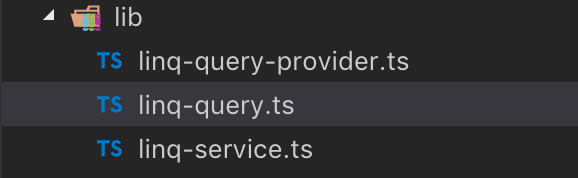

JavaScript ile Linq yazı serimizin sekizincisine hoş geldiniz.

1. [Linq gerçekte nedir?](/javascript-linq-01)
2. [Expression'lar](/javascript-linq-02)
3. [ExpressionVisitor sınıfı](/javascript-linq-03)
4. [IQueryable ve IQueryProvider](/javascript-linq-03)
5. [Jokenizer - JavaScript Expression'larını parse edelim](/javascript-linq-05)
6. [Jokenizer.Net - C# Expression'larını parse edelim](/javascript-linq-06)
7. [DynamicQueryable - Dinamik sorgu oluşturalım](/javascript-linq-07)
8. [Jinqu - JavaScript ile Linq](/javascript-linq-08)
9. Linquest ve Linquest.AspNetCore - Asp.Net Core ile cevap verelim  **(You are here)**

Bu yazıda [linquest](https://github.com/jin-qu/linquest) projesi sayesinde JavaScript ile oluşturabilir hale geldiğimiz kazandırdığımız Linq sorgularını tarayıcılarımızdan sunucumuza taşıyıp [linquest](https://github.com/jin-qu/Linquest.AspNetCore) projesi aracılığıyla çalıştıracağız.

# linquest

Hemen proje yapımıza göz atarak başlayalım:



Gördüğünüz bunu gibi çok az bir geliştirme ile yapabiliyoruz, önceki makalelerde değindiğimiz projeler bizim için güzel bir altyapı sağlıyorlar. Hemen dosyaları inceleyerek başlayalım.

## ./linq-query.ts

İlk önce [jinqu](/javascript-linq-08) ile hazırladığımız sorgu sınıfında neler değiştirmişiz bakalım.

```typescript
// jinqu'dan gelen AjaxOptions'a "pascalize" özelliğini ekliyoruz
// bazı kütüphaneler sunucuda PascalCase olan tipleri camelCase oluşturabiliyorlar
// örneğin swagger varsayılan ayarda bunu yapıyor
// linquest sunucu tarafında düzgün çalışmayı sağlayabilmek için PascalCase dönüşümü yapabiliyor
export interface QueryOptions extends AjaxOptions {
    pascalize?: boolean;
}

// Entity Framework ile çalışırken kullandığımız "Include" metoduna destek veriyoruz
const LinqFuncs = {
    include: 'include'
};

// sorgu tipimiz LinqQuery jinqu projesinden gelen Query'den türüyor
export class LinqQuery<T, TOptions extends QueryOptions = QueryOptions> extends Query<T> {

    // include metoduna destek veriyoruz
    // bir önceki makalede gördüğümüz gibi include için QueryPart içeren yeni sorgu dönüyoruz
    include(selector: Func1<T, any>): LinqQuery<T, TOptions> {
        return <any>this.create(QueryPart.create(LinqFuncs.include, [PartArgument.identifier(selector, [])]));
    }

    // sunucuya gönderilecek HTTP ayarlarını parametre olarak geçebileceğimiz metot
    // bu parametreleri de QueryPart ile tutuyoruz (literal)
    // çalıştırma sırasında bu parametreler birleştirilecek (birazdan göreceğiz)
    withOptions(options: TOptions): LinqQuery<T, TOptions> {
        return <any>this.create(QueryPart.create(AjaxFuncs.options, [PartArgument.literal(options)]));
    }

    // URL parametresi geçmek için bir kısayol
    // normalde parametre geçmek için withOptions({ params: [...] }) çağrısı yapmak gerekecekti
    setParameter(key: string, value: any) {
        return this.withOptions(<any>{ params: [{ key, value }] });
    }
}
```

Sorgu tipimiz bu kadar, sunucuya gönderilmesini istediğimiz **header**, **url**, **content-type** gibi değerleri geçebileceğimiz ve ekstradan **include** sorgu parametresine destek veren yeni bir sorgu tipi oluşturduk.

## ./linq-service.ts

Sunucu üzerinde sorgu yapabileceğimiz bir servisi (Asp.Net için Controller olarak düşünebilirsiniz) temsil eden sınıfımız. [Bir önceki](/javascript-linq-08) yazıda gördüğümüz **IRequestProvider** interface'ini gerçekliyor, yani bir istek sağlayıcı.

```typescript
export class LinqService implements IRequestProvider<QueryOptions> {

    // sunucuda ulaşılacak servis için adresi ve AJAX çağrısı yapacak kütüphaneyi parametre alıyor
    // eğer AJAX için bir kütüphane geçilmez ise FetchProvider kullanıyor
    constructor(private readonly baseAddress = '', private readonly ajaxProvider: IAjaxProvider = new FetchProvider()) {
    }

    // varsayılan ayarlar ile her seferinde tekrar parametre vermek istemediğimiz ayarları geçebiliriz
    // jQuery varsayılan AJAX ayarları gibi: https://api.jquery.com/jquery.ajaxsetup/
    static readonly defaultOptions: QueryOptions = {};

    // sorgumuza geçilmiş parametreler ve ayarlara göre AJAX çağrısı yapıyoruz
    request<TResult>(params: QueryParameter[], options: QueryOptions[]): PromiseLike<TResult> {
        // varsayılan ayarları bir objeye kopyaladık
        const d = Object.assign({}, LinqService.defaultOptions);
        // sorgumuza parametre geçilmiş ayarlar ile birleştirdik
        const o = (options || []).reduce(mergeQueryOptions, d);
        // sorgu yapılacak adresi ayarladık
        if (this.baseAddress) {
            if (this.baseAddress[this.baseAddress.length - 1] !== '/' && o.url && o.url[0] !== '/') {
                o.url = '/' + o.url;
            }
            o.url = this.baseAddress + (o.url || '');
        }
        // sorgumuza geçilen parametreleri URL parametreleri ile birleştiriyoruz
        o.params = (params || []).concat(o.params || []);

        // ajaxProvider'a çalıştırması için ayarlarımızı gönderiyoruz
        return this.ajaxProvider.ajax(o);
    }

    // servisimiz bizim için sorgu da oluşturabiliyor
    // provider üzerinden oluşturduğu sorguya servis üzerinde ulaşmak istediğimiz metodu parametre geçiyor (url)
    createQuery<T>(url: string) {
        return new LinqQueryProvider<QueryOptions>(this).createQuery<T>().withOptions({ url });
    }
}
```

**FetchProvider** nereden geliyor derseniz, [jinqu-fetch](https://github.com/jin-qu/jinqu-fetch) projesini incelemeyi size bırakıyorum. Kısaca bir önceki yazıda gördüğümüz **IAjaxProvider** interface'ini gerçekleyen bir sınıf sadece. İsterseniz Fetch yerine başka bir sağlayıcı da geçebilirsiniz, kullanıma hazır bir diğeri ise [jinqu-axios](https://github.com/jin-qu/jinqu-axios). Tabii kendiniz de çok kolay bir şekilde geliştirebilirsiniz, hadi bakın şu kodlara :)

Testleri incelerseniz servis sınıfımızın kullanımı ne kadar kolaylaştırdığını da görebilirsiniz. Ayrıca [swagger](http://swagger.io) destekleyen servisler için otomatik kod da oluşturabiliyoruz, **swagger** projesindeki bazı sıkıntılardan dolayı şimdilik PR almadıkları için bu özelliğe [swagger-codegen](https://github.com/swagger-api/swagger-codegen) üzerinden erişemiyorsunuz, [forklanmış proje](https://github.com/jin-qu/swagger-codegen) ile üretmeniz gerekiyor. Testlerden aldığımız bir örneği görelim:

```typescript
export class CompanyService extends LinqService {

    constructor(provider?: MockRequestProvider) {
        super('api', provider);
    }

    companies() {
        return this.createQuery<Company>('Companies');
    }
}

const service = new CompanyService(provider);

const query = await service.companies()
    .withOptions({ pascalize: true })
    .setParameter('token', '42')
    .where(c => c.name === 'Netflix')
    .toArrayAsync();
```

Bu sorgumuzu **provider** nasıl yorumluyor görelim.

## ./linq-query-provider.ts

Daha önce sık sık **provider** sorguyu istediği gibi yorumlar demiştik. İşte sorguyu alıp ağ üzerinden sunucuya gönderebilen bir provider, **LinqQueryProvider**.

```typescript
export class LinqQueryProvider<TOptions extends QueryOptions> implements IQueryProvider {

    // sorguyu çalıştırmak için kullanılacak requestProvider parametre olarak alınıyor
    constructor(protected requestProvider: IRequestProvider<TOptions>) {
    }

    // geçilen parametrelere sahip yeni bir sorgu oluşturuyor
    // bu metot IQueryProvider'dan geliyor
    createQuery<T>(parts?: IQueryPart[]): LinqQuery<T, TOptions> {
        return new LinqQuery<T, TOptions>(this, parts);
    }

    // senkron çalıştırma artık web üzerinde kabul görmeyen bir yaklaşım, biz de desteklenmiyoruz
    execute<T = any, TResult = PromiseLike<T[]>>(parts: IQueryPart[]): TResult {
        throw new Error('Synchronous execution is not supported');
    }

    // sorgumuzu çalıştırıp bir Promise dönen metodumuz
    executeAsync<T = any, TResult = T[]>(parts: IQueryPart[]): PromiseLike<TResult> {
        // ** kodlar basitleştirildi **
        // her bir "part" web sorgusu için parametreye çeviriliyor
        // oluşan bu parametreler "requestProvider" ile web çağrısı olarak çalıştırılıyor
        return this.requestProvider.request<TResult>(ps.map(p => this.handlePart(p)), os);
    }

    handlePart(part: IQueryPart): QueryParameter {
        // PartArgument'lerden literal olanlar için değer alınırken expression olanlar yorumlanıyor
        const args = part.args.map(a =>
            a.literal != null || a.exp == null
                ? a.literal
                : this.expToStr(a.exp, a.scopes, a.exp.type === ExpressionType.Func ? (a.exp as FuncExpression).parameters : [])
        ).join(';');
        return { key: '$' + part.type, value: args };
    }

    // bu fonksiyon ile bir expression'ın web üzerinden gönderilebilmesi için string dönüşümü yapılıyor
    expToStr(exp: Expression, scopes: any[], parameters: string[]): string {
        // parametreler FuncExpression'lara (lambda) geçilen parametreler
        // "a => a + b"
        // gibi bir expression için "a" ve "b" bir değişken ancak yorumlanırken "a" parametre olmalı
        // string dönüşümü yaparken parametre listesinde bulduğumuz değişkenleri olduğu gibi bırakıyoruz
        // bu sorgu için "{ b: 42 }" scope'u geçilirse oluşacak web parametresi aşağıdaki gibi olacak
        // "a => a + 42"
        switch (exp.type) {
            case ExpressionType.Literal:
                return this.literalToStr(exp as LiteralExpression);
            case ExpressionType.Variable:
                return this.variableToStr(exp as VariableExpression, scopes, parameters);
            case ExpressionType.Object:
                return this.objectToStr(exp as ObjectExpression, scopes, parameters);
            // ...
            default:
                throw new Error(`Unsupported expression type ${exp.type}`);
        }
    }

    // LiteralExpression için direk "value" değerini string'e çeviriyoruz
    literalToStr(exp: LiteralExpression) {
        return this.valueToStr(exp.value);
    }

    variableToStr(exp: VariableExpression, scopes: any[], parameters: string[]) {
        const name = exp.name;
        // değişken ifadeleri için öncelikle geçerli parametreleri arıyoruz
        // eğer parametre ise bir lambda için kullanılıyordur, değerini bulmaya çalışmıyoruz
        if (parameters.indexOf(name) >= 0) return name;

        // eğer parametre değil ise, değerini gönderilmiş "scope"lar içinde arıyoruz
        // bulamazsak değişken adını geçiyoruz, yorumu sunucuya bırakıyoruz
        const s = scopes && scopes.find(s => name in s);
        return (s && this.valueToStr(s[name])) || name;
    }

    // ...

    objectToStr(exp: ObjectExpression, scopes: any[], parameters: string[]) {
        // "{ a, b: c }" gibi bir obje oluşturma ifadesi için bu metot çağırılır
        const assigns = exp.members.map(m => {
            const ae = m as AssignExpression;
            return `${ae.name} = ${this.expToStr(ae.right, scopes, parameters)}`;
        }).join(', ');

        // yukarıdaki ifade işlenirken { c: "Test" } gibi bir scope geçildiğinde aşağıdaki string oluşur
        // "new { a, b: "Test" }"
        return `new {${assigns}}`;
    }

    // diğer ifadeler için de string dönüşümü yapan metodlar çok benzer

    // JavaScript veri tipleri için sunucuda yorumlanabilecek şekilde string dönüşümü yapan yardımcı metot
    valueToStr(value) {
        if (value == null)
            return 'null';
        // zaten string değerlerindeki " değerlerini "" ile değiştirip ifadeyi " (çift tırnak) içine alıyoruz
        if (typeof value === 'string')
            return `"${value.replace(/"/g, '""')}"`;
        // tarih değerlerini ISO formatında dönüyoruz
        if (Object.prototype.toString.call(value) === '[object Date]')
            return `"${value.toISOString()}"`;

        return value;
    }
    // ...
}
```

Bu dosyada QueryProvider sınıfımız bulunmakta, yaptığı işi kodlardan önemli parçaları taşıdığım yukarıdaki satırlarda commentler ile açıklamaya çalıştım.

Tabi mantık olarak ne yaptığına değinmemiz gerekli, büyük ihtimalle önceki yazılardan yavaş yavaş üstüne koyarak ulaşmak istediğimiz noktayı anladınız. JavaScript ile Linq gibi metodlar ile veri sorgulayabilmek ve şimdi bulunduğumuz noktada QueryProvider ile bu sorguyu uzaktaki bir sunucu üzerinde çalıştırabilmek.

Bir örnek ile sonucu görelim:

```typescript

const service = new CompanyService();
const query = service.companies()
    .setParameter('id', '42')
    .where(c => !c.deleted && ((c.id < 3 && c.name === "Netflix") || (c.id >= 3 && c.name !== 'Netflix')));
const result = await query.toArrayAsync();

// sorgumuz üst satırdaki gibi çalıştırıldığında sunucuya aşağıdaki istek yapılacak
// http://ServerUrl/ServicePath/Companies?$where=c%3D%3E%20%21c.deleted%20%26%26%20%28%28c.id%20%3C%203%20%26%26%20c.name%20%3D%3D%20%22Netflix%22%29%20%7C%7C%20%28c.id%20%3E%3D%203%20%26%26%20c.name%20%21%3D%20%22Netflix%22%29%29

// :=) yukarıdaki satır URL Encode edilmiş halde, okunabilir hali aşağıdaki gibi olacak
// http://ServerUrl/ServicePath/Companies?$where=c => !c.deleted && ((c.id < 3 && c.name == "Netflix") || (c.id >= 3 && c.name != "Netflix"))
```

Artık yaptığımız bu isteği yorumlayıp bize yanıt dönmek sunucunun sorumluluğunda.

# Linquest.AspNetCore

Linquest sorguları sunuculara yukarıdaki gibi iletiliyor, dolayısı ile geriye sunucu tarafında bu parametreleri yorumlak kalıyor.

> There are two ways to write error-free programs; only the third one works. - Alan J. Perlis
