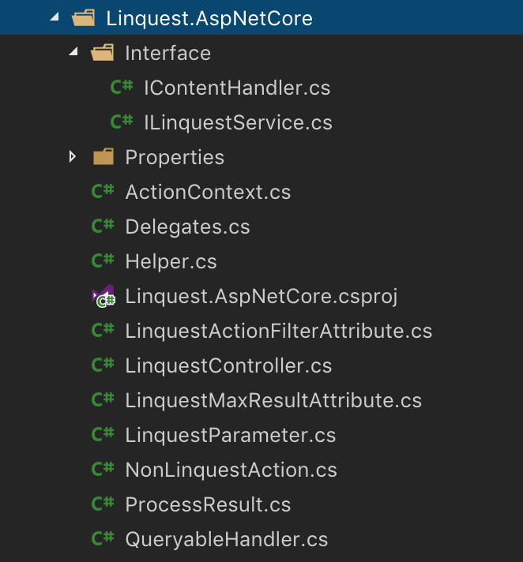

JavaScript ile Linq yazı serimizin dokuzuncusuna hoş geldiniz arkadaşlar.

1. [Linq gerçekte nedir?](/javascript-linq-01)
2. [Expression'lar](/javascript-linq-02)
3. [ExpressionVisitor sınıfı](/javascript-linq-03)
4. [IQueryable ve IQueryProvider](/javascript-linq-03)
5. [Jokenizer - JavaScript Expression'larını parse edelim](/javascript-linq-05)
6. [Jokenizer.Net - C# Expression'larını parse edelim](/javascript-linq-06)
7. [DynamicQueryable - Dinamik sorgu oluşturalım](/javascript-linq-07)
8. [Jinqu - JavaScript ile Linq](/javascript-linq-08)
9. Linquest ve Linquest.AspNetCore - Asp.Net Core ile cevap verelim  **(You are here)**

Bu yazıda [linquest](https://github.com/jin-qu/linquest) projesi sayesinde JavaScript ile oluşturabilir hale geldiğimiz kazandırdığımız Linq sorgularını tarayıcılarımızdan sunucumuza taşıyıp [linquest](https://github.com/jin-qu/Linquest.AspNetCore) projesi aracılığıyla çalıştıracağız.

# linquest

Hemen proje yapımıza göz atarak başlayalım:


Gördüğünüz bunu gibi çok az bir geliştirme ile yapabiliyoruz, önceki makalelerde değindiğimiz projeler bizim için güzel bir altyapı sağlıyorlar. Hemen dosyaları inceleyerek başlayalım.

## ./linq-query.ts

İlk önce [jinqu](/javascript-linq-08) ile hazırladığımız sorgu sınıfında neler değiştirmişiz bakalım.

```typescript
// jinqu'dan gelen AjaxOptions'a "pascalize" özelliğini ekliyoruz
// bazı kütüphaneler sunucuda PascalCase olan tipleri camelCase oluşturabiliyorlar
// örneğin swagger varsayılan ayarda bunu yapıyor
// linquest sunucu tarafında düzgün çalışmayı sağlayabilmek için PascalCase dönüşümü yapabiliyor
export interface QueryOptions extends AjaxOptions {
    pascalize?: boolean;
}

// Entity Framework ile çalışırken kullandığımız "Include" metoduna destek veriyoruz
const LinqFuncs = {
    include: 'include'
};

// sorgu tipimiz LinqQuery jinqu projesinden gelen Query'den türüyor
export class LinqQuery<T, TOptions extends QueryOptions = QueryOptions> extends Query<T> {

    // include metoduna destek veriyoruz
    // bir önceki makalede gördüğümüz gibi include için QueryPart içeren yeni sorgu dönüyoruz
    include(selector: Func1<T, any>): LinqQuery<T, TOptions> {
        return <any>this.create(QueryPart.create(LinqFuncs.include, [PartArgument.identifier(selector, [])]));
    }

    // sunucuya gönderilecek HTTP ayarlarını parametre olarak geçebileceğimiz metot
    // bu parametreleri de QueryPart ile tutuyoruz (literal)
    // çalıştırma sırasında bu parametreler birleştirilecek (birazdan göreceğiz)
    withOptions(options: TOptions): LinqQuery<T, TOptions> {
        return <any>this.create(QueryPart.create(AjaxFuncs.options, [PartArgument.literal(options)]));
    }

    // URL parametresi geçmek için bir kısayol
    // normalde parametre geçmek için withOptions({ params: [...] }) çağrısı yapmak gerekecekti
    setParameter(key: string, value: any) {
        return this.withOptions(<any>{ params: [{ key, value }] });
    }
}
```

Sorgu tipimiz bu kadar, sunucuya gönderilmesini istediğimiz **header**, **url**, **content-type** gibi değerleri geçebileceğimiz ve ekstradan **include** sorgu parametresine destek veren yeni bir sorgu tipi oluşturduk.

## ./linq-service.ts

Sunucu üzerinde sorgu yapabileceğimiz bir servisi (Asp.Net için Controller olarak düşünebilirsiniz) temsil eden sınıfımız. [Bir önceki](/javascript-linq-08) yazıda gördüğümüz **IRequestProvider** interface'ini gerçekliyor, yani bir istek sağlayıcı.

```typescript
export class LinqService implements IRequestProvider<QueryOptions> {

    // sunucuda ulaşılacak servis için adresi ve AJAX çağrısı yapacak kütüphaneyi parametre alıyor
    // eğer AJAX için bir kütüphane geçilmez ise FetchProvider kullanıyor
    constructor(private readonly baseAddress = '', private readonly ajaxProvider: IAjaxProvider = new FetchProvider()) {
    }

    // varsayılan ayarlar ile her seferinde tekrar parametre vermek istemediğimiz ayarları geçebiliriz
    // jQuery varsayılan AJAX ayarları gibi: https://api.jquery.com/jquery.ajaxsetup/
    static readonly defaultOptions: QueryOptions = {};

    // sorgumuza geçilmiş parametreler ve ayarlara göre AJAX çağrısı yapıyoruz
    request<TResult>(params: QueryParameter[], options: QueryOptions[]): PromiseLike<TResult> {
        // varsayılan ayarları bir objeye kopyaladık
        const d = Object.assign({}, LinqService.defaultOptions);
        // sorgumuza parametre geçilmiş ayarlar ile birleştirdik
        const o = (options || []).reduce(mergeQueryOptions, d);
        // sorgu yapılacak adresi ayarladık
        if (this.baseAddress) {
            if (this.baseAddress[this.baseAddress.length - 1] !== '/' && o.url && o.url[0] !== '/') {
                o.url = '/' + o.url;
            }
            o.url = this.baseAddress + (o.url || '');
        }
        // sorgumuza geçilen parametreleri URL parametreleri ile birleştiriyoruz
        o.params = (params || []).concat(o.params || []);

        // ajaxProvider'a çalıştırması için ayarlarımızı gönderiyoruz
        return this.ajaxProvider.ajax(o);
    }

    // servisimiz bizim için sorgu da oluşturabiliyor
    // provider üzerinden oluşturduğu sorguya servis üzerinde ulaşmak istediğimiz metodu parametre geçiyor (url)
    createQuery<T>(url: string) {
        return new LinqQueryProvider<QueryOptions>(this).createQuery<T>().withOptions({ url });
    }
}
```

**FetchProvider** nereden geliyor derseniz, [jinqu-fetch](https://github.com/jin-qu/jinqu-fetch) projesini incelemeyi size bırakıyorum. Kısaca bir önceki yazıda gördüğümüz **IAjaxProvider** interface'ini gerçekleyen bir sınıf sadece. İsterseniz Fetch yerine başka bir sağlayıcı da geçebilirsiniz, kullanıma hazır bir diğeri ise [jinqu-axios](https://github.com/jin-qu/jinqu-axios). Tabii kendiniz de çok kolay bir şekilde geliştirebilirsiniz, hadi bakın şu kodlara :)

Testleri incelerseniz servis sınıfımızın kullanımı ne kadar kolaylaştırdığını da görebilirsiniz. Ayrıca [swagger](http://swagger.io) destekleyen servisler için otomatik kod da oluşturabiliyoruz, **swagger** projesindeki bazı sıkıntılardan dolayı şimdilik PR almadıkları için bu özelliğe [swagger-codegen](https://github.com/swagger-api/swagger-codegen) üzerinden erişemiyorsunuz, [forklanmış proje](https://github.com/jin-qu/swagger-codegen) ile üretmeniz gerekiyor. Testlerden aldığımız bir örneği görelim:

```typescript
export class CompanyService extends LinqService {

    constructor(provider?: MockRequestProvider) {
        super('api', provider);
    }

    companies() {
        return this.createQuery<Company>('Companies');
    }
}

const service = new CompanyService(provider);

const query = await service.companies()
    .withOptions({ pascalize: true })
    .setParameter('token', '42')
    .where(c => c.name === 'Netflix')
    .toArrayAsync();
```

Bu sorgumuzu **provider** nasıl yorumluyor görelim.

## ./linq-query-provider.ts

Daha önce sık sık **provider** sorguyu istediği gibi yorumlar demiştik. İşte sorguyu alıp ağ üzerinden sunucuya gönderebilen bir provider, **LinqQueryProvider**.

```typescript
export class LinqQueryProvider<TOptions extends QueryOptions> implements IQueryProvider {

    // sorguyu çalıştırmak için kullanılacak requestProvider parametre olarak alınıyor
    constructor(protected requestProvider: IRequestProvider<TOptions>) {
    }

    // geçilen parametrelere sahip yeni bir sorgu oluşturuyor
    // bu metot IQueryProvider'dan geliyor
    createQuery<T>(parts?: IQueryPart[]): LinqQuery<T, TOptions> {
        return new LinqQuery<T, TOptions>(this, parts);
    }

    // senkron çalıştırma artık web üzerinde kabul görmeyen bir yaklaşım, biz de desteklenmiyoruz
    execute<T = any, TResult = PromiseLike<T[]>>(parts: IQueryPart[]): TResult {
        throw new Error('Synchronous execution is not supported');
    }

    // sorgumuzu çalıştırıp bir Promise dönen metodumuz
    executeAsync<T = any, TResult = T[]>(parts: IQueryPart[]): PromiseLike<TResult> {
        // ** kodlar basitleştirildi **
        // her bir "part" web sorgusu için parametreye çeviriliyor
        // oluşan bu parametreler "requestProvider" ile web çağrısı olarak çalıştırılıyor
        return this.requestProvider.request<TResult>(ps.map(p => this.handlePart(p)), os);
    }

    handlePart(part: IQueryPart): QueryParameter {
        // PartArgument'lerden literal olanlar için değer alınırken expression olanlar yorumlanıyor
        const args = part.args.map(a =>
            a.literal != null || a.exp == null
                ? a.literal
                : this.expToStr(a.exp, a.scopes, a.exp.type === ExpressionType.Func ? (a.exp as FuncExpression).parameters : [])
        ).join(';');
        return { key: '$' + part.type, value: args };
    }

    // bu fonksiyon ile bir expression'ın web üzerinden gönderilebilmesi için string dönüşümü yapılıyor
    expToStr(exp: Expression, scopes: any[], parameters: string[]): string {
        // parametreler FuncExpression'lara (lambda) geçilen parametreler
        // "a => a + b"
        // gibi bir expression için "a" ve "b" bir değişken ancak yorumlanırken "a" parametre olmalı
        // string dönüşümü yaparken parametre listesinde bulduğumuz değişkenleri olduğu gibi bırakıyoruz
        // bu sorgu için "{ b: 42 }" scope'u geçilirse oluşacak web parametresi aşağıdaki gibi olacak
        // "a => a + 42"
        switch (exp.type) {
            case ExpressionType.Literal:
                return this.literalToStr(exp as LiteralExpression);
            case ExpressionType.Variable:
                return this.variableToStr(exp as VariableExpression, scopes, parameters);
            case ExpressionType.Object:
                return this.objectToStr(exp as ObjectExpression, scopes, parameters);
            // ...
            default:
                throw new Error(`Unsupported expression type ${exp.type}`);
        }
    }

    // LiteralExpression için direk "value" değerini string'e çeviriyoruz
    literalToStr(exp: LiteralExpression) {
        return this.valueToStr(exp.value);
    }

    variableToStr(exp: VariableExpression, scopes: any[], parameters: string[]) {
        const name = exp.name;
        // değişken ifadeleri için öncelikle geçerli parametreleri arıyoruz
        // eğer parametre ise bir lambda için kullanılıyordur, değerini bulmaya çalışmıyoruz
        if (parameters.indexOf(name) >= 0) return name;

        // eğer parametre değil ise, değerini gönderilmiş "scope"lar içinde arıyoruz
        // bulamazsak değişken adını geçiyoruz, yorumu sunucuya bırakıyoruz
        const s = scopes && scopes.find(s => name in s);
        return (s && this.valueToStr(s[name])) || name;
    }

    // ...

    objectToStr(exp: ObjectExpression, scopes: any[], parameters: string[]) {
        // "{ a, b: c }" gibi bir obje oluşturma ifadesi için bu metot çağırılır
        const assigns = exp.members.map(m => {
            const ae = m as AssignExpression;
            return `${ae.name} = ${this.expToStr(ae.right, scopes, parameters)}`;
        }).join(', ');

        // yukarıdaki ifade işlenirken { c: "Test" } gibi bir scope geçildiğinde aşağıdaki string oluşur
        // "new { a, b: "Test" }"
        return `new {${assigns}}`;
    }

    // diğer ifadeler için de string dönüşümü yapan metodlar çok benzer

    // JavaScript veri tipleri için sunucuda yorumlanabilecek şekilde string dönüşümü yapan yardımcı metot
    valueToStr(value) {
        if (value == null)
            return 'null';
        // zaten string değerlerindeki " değerlerini "" ile değiştirip ifadeyi " (çift tırnak) içine alıyoruz
        if (typeof value === 'string')
            return `"${value.replace(/"/g, '""')}"`;
        // tarih değerlerini ISO formatında dönüyoruz
        if (Object.prototype.toString.call(value) === '[object Date]')
            return `"${value.toISOString()}"`;

        return value;
    }
    // ...
}
```

Bu dosyada QueryProvider sınıfımız bulunmakta, yaptığı işi kodlardan önemli parçaları taşıdığım yukarıdaki satırlarda commentler ile açıklamaya çalıştım.

Tabi mantık olarak ne yaptığına değinmemiz gerekli, büyük ihtimalle önceki yazılardan yavaş yavaş üstüne koyarak ulaşmak istediğimiz noktayı anladınız. JavaScript ile Linq gibi metodlar ile veri sorgulayabilmek ve şimdi bulunduğumuz noktada QueryProvider ile bu sorguyu uzaktaki bir sunucu üzerinde çalıştırabilmek.

Bir örnek ile sonucu görelim:

```typescript

const service = new CompanyService();
const query = service.companies()
    .setParameter('id', '42')
    .where(c => !c.deleted && ((c.id < 3 && c.name === "Netflix") || (c.id >= 3 && c.name !== 'Netflix')));
const result = await query.toArrayAsync();

// sorgumuz üst satırdaki gibi çalıştırıldığında sunucuya aşağıdaki istek yapılacak
// http://ServerUrl/ServicePath/Companies?$where=c%3D%3E%20%21c.deleted%20%26%26%20%28%28c.id%20%3C%203%20%26%26%20c.name%20%3D%3D%20%22Netflix%22%29%20%7C%7C%20%28c.id%20%3E%3D%203%20%26%26%20c.name%20%21%3D%20%22Netflix%22%29%29

// :=) yukarıdaki satır URL Encode edilmiş halde, okunabilir hali aşağıdaki gibi olacak
// http://ServerUrl/ServicePath/Companies?$where=c => !c.deleted && ((c.id < 3 && c.name == "Netflix") || (c.id >= 3 && c.name != "Netflix"))
```

Artık yaptığımız bu isteği yorumlayıp bize yanıt dönmek sunucunun sorumluluğunda.

# Linquest.AspNetCore

Linquest sorguları sunuculara yukarıdaki gibi iletiliyor, dolayısı ile geriye sunucu tarafında bu parametreleri yorumlak kalıyor. Bu işi de Linquest.AspNetCore ile yapacağız. Hemen proje yapısına göz atalım:




> https://jakeydocs.readthedocs.io/en/latest/_images/filter-pipeline-2.png

Resimde gördüğünüz gibi **ActionFilter** yazarak bir **Controller** metodu çalıştıktan sonra-yanıt dönülmeden önce araya girebiliriz.

## ./Interface/IContentHandler.cs

Öncelikle istemci tarafından gelen bu parametreleri işleyebilecek genel bir yapıya ihtiyacımız var. Sadece **IQueryable** desteklemek zorunda değiliz, şöyle düşünün, bu parametreleri istenirse **Dappar**, **Massive** gibi Micro ORM'ler ile de çalışabilmeli. Bunu sağlamak için **IContentHandler** arayüzünü gerçeklemek yeterli olacaktır. Kod çok basit:

```csharp
public interface IContentHandler<in T>: IContentHandler {
    ProcessResult HandleContent(T value, ActionContext context);
}
```

Dışarıdan gelen değeri **ActionContext** (birazdan göreceğiz) ile iletilen parametreler ile işleyip yanıt dönmek yeterli olacak. Biz şimdilik sadece ***T*** için **IQueryable** uygulayacağız.

## ./Interface/ILinquestService.cs

İstemciden gelen bu istekleri yorumlarken sunucu tarafında araya girebilmek, ortak kurallar işletebilmek çok kullanışlı olabiliyor. İsteklerin iletildiği **Controller**, **ILinquestService** arayüzünü gerçekleyerek bu yeteneği kazanıyor.

```csharp
public interface ILinquestService {
    // parametreler sorguya yansıtılmadan önce çağırılıyor
    event BeforeQueryDelegate BeforeHandleQuery;
    // parametreler yansıtıldıktan sonra, çalıştırılmadan önce çağırılıyor
    event BeforeQueryDelegate BeforeQueryExecute;
    // sorgu çalıştırıldıktan sonra çağırılıyor
    event AfterQueryDelegate AfterQueryExecute;
    // bir sorgudan okunabilecek maksimum kayıt sayısını belirleyebiliyoruz
    int? MaxResultCount { get; set; }
    // istemciye geri dönülecek yanıtın son halini oluşturmak için çağırılıyor
    ProcessResult ProcessRequest(ActionContext context);
}
```

Böylece örnek olarak aşağıdaki gibi senaryolara destek sağlayabiliyoruz:

* Sorgu yorumlanmadan önce **Take** parametresi olmasını zorunlu kılabiliriz
* Kullanılmasını istemediğimiz (örneğin **GroupBy**) parametreleri yasaklayabiliriz
* Yorumlanmış sorguya ek parametreler ekleyebiliriz
* Çalıştırılmış sorgu üzerinde yetki kontrolü yapabiliriz
* En fazla 100 kayıt okunabilmesi gibi bir kural koyarak verileri güvenceye alabiliriz
* Yanıt olarak dönülecek veri üzerinde değişiklik yapabiliriz
* ...liste böyle uzar gider...

## ./ActionContext.cs

Gelen bir isteği temsil eden bu sınıfımız aşağıdaki gibi:

```csharp
public class ActionContext {
    // Çalıştırılan metot
    public ActionDescriptor Descriptor { get; }
    // Metodun dönüş değeri, bu değer üzerinde çalışacağız
    public object Value { get; }
    // İstmeciden iletilen parametreler
    public IEnumerable<LinquestParameter> Parameters { get; }
    // Controller'ımız ILinquestService ise bu değer dolu gelecektir (olmak zorunda değil)
    public ILinquestService Service { get; }
    // Bu metot için izin verilen maksimum okunabilecek kayıt sayısı
    public int? MaxResultCount { get; set; }
}
```

## ./LinquestActionFilterAttribute.cs

Esas işi yapan kodumuz, hemen görelim:

```csharp
// Metotlar ve Controllerlar ile kullanabiliyoruz
// Eğer Controller'a verirsek tüm ActionFilter'larda olduğu gibi
// Controller içindeki tüm Action'larda geçerli oluyor
[AttributeUsage(AttributeTargets.Method | AttributeTargets.Class, AllowMultiple = false)]
public class LinquestActionFilterAttribute : ActionFilterAttribute {

    // Action çalıştırılırken araya giriyoruz
    public override void OnResultExecuting(ResultExecutingContext context) {
        base.OnResultExecuting(context);

        // Yanıt eğer ObjectResult değilse karışmıyoruz
        // Dönüş değeri ActionResult'dan türemeyen tüm metotlar ObjectResult döner
        // Örneğin JsonResult, ViewResult gibi dönüş değerlerine karışmıyoruz
        if (!(context.Result is ObjectResult objectResult))
            return;

        // Action üzerine NonLinquestAction Attribute koyarak bu metoda karışma diyebiliriz
        var cad = context.ActionDescriptor as ControllerActionDescriptor;
        if (cad != null && cad.MethodInfo.CustomAttributes.Any(a => a.AttributeType == typeof(NonLinquestActionAttribute)))
            return;

        var value = objectResult.Value;
        var service = context.Controller as ILinquestService;
        var request = context.HttpContext.Request;
        var response = context.HttpContext.Response;

        // Bu Action için maksimum kayıt sayısı sınırı konmuş mu?
        var maxAttr = cad?.MethodInfo.CustomAttributes.FirstOrDefault(a => a.AttributeType == typeof(LinquestMaxResultAttribute));
        var max = (int?)maxAttr?.ConstructorArguments.First().Value;
        // Action özet objemizi oluşturuyoruz
        var ac = new ActionContext(context.ActionDescriptor, value, GetParameters(request), service)
        {
            MaxResultCount = max
        };
        // İsteği yorumluyoruz
        var processResult = ProcessRequest(ac, context.HttpContext.RequestServices);
        // Oluşturulan yanıtı dönüyoruz.
        // Bu noktadan sonra Asp.Net Core bizim için serileştirme işlemini yapıp yanıtı istemciye dönecek
        context.Result = HandleResponse(processResult, response);
    }

    // Http isteğinden (Request) parametreleri okuyoruz. $ ile başlayanlar bizim için önemli
    protected virtual IReadOnlyList<LinquestParameter> GetParameters(HttpRequest request)
        => request.Query
            .Where(q => q.Key.StartsWith("$"))
            .Select(q => new LinquestParameter(q.Key, q.Value.ToString()))
            .ToList()
            .AsReadOnly();

    // Parametreleri eğer bir ILinquestService varsa onun üzerinden yok ise varsayılan şekilde yorumluyoruz
    protected virtual ProcessResult ProcessRequest(ActionContext context, IServiceProvider serviceProvider)
        => context.Service != null
            ? context.Service.ProcessRequest(context)
            : Helper.DefaultRequestProcessor(context, serviceProvider);

    // Yanıtı oluşturuyoruz
    protected virtual ActionResult HandleResponse(ProcessResult result, HttpResponse response) {
        // Eğer sorgu bir InlineCount dönmüş ise bunu Http Header olarak istemciye dönüyoruz
        var inlineCount = result.InlineCount;
        if (inlineCount != null && !response.Headers.ContainsKey("X-InlineCount")) {
            response.Headers.Add("X-InlineCount", inlineCount.ToString());
        }

        // Yeni bir ObjectResult oluşturuyoruz
        // Serialization-Deserialization işlerine karışmıyoruz, projeniz nasıl ayarlanmış ise öyle çalışıyor
        return new ObjectResult(result.Result);
    }
}
```

Yukarıdaki kodları incelediğinizde aklınızda sadece **ProcessRequest** nasıl çalışıyor sorusu kalmalı, diğer kodlar çok sıradan işler yapıyor.

## ./Helper.cs

Varsayılan istek işleyicimiz aşağıdaki gibi. İstenirse **ILinquestService** ile bu yapının özelleştirilebileceğini söylemiştik.

```csharp
public static ProcessResult DefaultRequestProcessor(ActionContext context, IServiceProvider serviceProvider) {
    var value = context.Value;
    if (value == null)
        return new ProcessResult(context) { Result = null };

    // ServiceProvider'a bizim veri tipimizi işleyebilecek bir ContentHandler kayıtlı mı diye soruyoruz
    // Diyelim ki siz Linquest içinde yer alan IQueryable işleyen yapıyı değiştirmek istiyorsunuz
    // Yapmanız gereken kendi Handler'ınızı yazıp bunu bir servis olarak kaydetmek (muhtemelen Startup içinde)
    var handlerType = typeof(IContentHandler<>).MakeGenericType(value.GetType());
    var handler = serviceProvider?.GetService(handlerType);

    // Özel bir handler var ise isteği onun ile işle
    if (handler != null)
        return ((IContentHandler)handler).HandleContent(value, context);

    // Eğer özel handler yoksa ve objemiz bir IQueryable ise hazır Queryable Handler ile işle
    if (context.Value is IQueryable queryable)
        return QueryableHandler.Instance.HandleContent(queryable, context);

    // Bu tip objeyi işleyecek bir handler yok ise yanıtı olduğu gibi dön
    return new ProcessResult(context) { Result = value };
}
```

## ./LinquestController.cs

İstek işlenirken özelleştirme işlerini **ILinquestService** ile yapabildiğimizi söylemiştik.
Bu interface'i her kendiniz gerçeklemek istemiyorsanız hazır gerçeklenmişi var:

```csharp
[LinquestActionFilter]
public class LinquestController : ControllerBase, ILinquestService {

    public event BeforeQueryDelegate BeforeHandleQuery;
    public event BeforeQueryDelegate BeforeQueryExecute;
    public event AfterQueryDelegate AfterQueryExecute;
    public int? MaxResultCount { get; set; }

    protected virtual ProcessResult ProcessRequest(ActionContext context) {
        return Helper.DefaultRequestProcessor(context, this.HttpContext.RequestServices);
    }

    ProcessResult ILinquestService.ProcessRequest(ActionContext context) {
        return ProcessRequest(context);
    }

    void ILinquestService.OnBeforeHandleQuery(BeforeQueryEventArgs args)
        => BeforeHandleQuery?.Invoke(this, args);

    void ILinquestService.OnBeforeQueryExecute(BeforeQueryEventArgs args)
        => BeforeQueryExecute?.Invoke(this, args);

    void ILinquestService.OnAfterQueryExecute(AfterQueryEventArgs args)
        => AfterQueryExecute?.Invoke(this, args);
}
```

Olabildiğince sıradan ve sıkıcı kodlar içeriyor, geçelim :)

## Yardımcı Sınıflar

Yukarıdaki tiplere ek olarak incelemeyi gerektirmeyecek basitlikte aşağıdaki sınıflarımız var:

* **LinquestMaxResultAttribute**: Metot için maksimum okuma limiti koyabileceğimiz **Attribute**
* **LinquestParameter**: Bir parametreyi temsil eden key-value pair
* **NonLinquestAction**: Bir metodu es geçmek için işaretleyebildiğimiz boş **Attribute**
* **ProcessResult**: Bir istek işlendikten sonra oluşan sonucu tuttuğumuz obje. Sonucun yanında **InlineCount** bilgisini tutar.

## ./QueryableHandler.cs

Geldik son ve en önemli dosyamıza, parametreleri sorgularımıza işleten sınıfımız:

```csharp
public class QueryableHandler : IContentHandler<IQueryable>
```

Yukarıdaki tanım **IQueryable** tipindeki verileri işleyebiliyoruz anlamına geliyor.

```csharp
public virtual ProcessResult HandleContent(IQueryable query, ActionContext context) {
    var service = context.Service;
    if (service != null) {
        // eğer servis var ise sorgu işlenmeden önce haber veriyoruz
        var args = new BeforeQueryEventArgs(context, query);
        service.OnBeforeHandleQuery(args);
        // sorgu değiştirilmişse yenisini kullanıyoruz
        query = args.Query;
    }

    // hiç parametre yoksa direk dönüyoruz
    var parameters = context.Parameters;
    if (parameters == null || !parameters.Any())
        return CreateResult(context, query, null, null);

    // uzuuuun bir switch ile parametreleri yorumluyoruz
    // bazı case'leri sildim, örnek olarak bir kısmı yeterli olacaktır
    var inlineCountEnabled = false;
    int? takeCount = null;
    IQueryable inlineCountQuery = null;
    foreach (var prm in parameters) {
        switch (prm.Name.ToLowerInvariant()) {
            case "$where":
                inlineCountQuery = null;
                query = Where(query, prm.Value);
                break;
            case "$orderby":
                query = OrderBy(query, prm.Value);
                break;
            case "$select":
                query = Select(query, prm.Value);
                break;
            case "$skip":
                if (inlineCountEnabled && inlineCountQuery == null) {
                    inlineCountQuery = query;
                }
                query = Skip(query, Convert.ToInt32(prm.Value));
                break;
            case "$groupby":
                inlineCountQuery = null;
                var keyValue = prm.Value.Split(';');
                if (keyValue.Length > 2) throw new Exception("Invalid groupBy expression");

                var keySelector = keyValue[0];
                var valueSelector = keyValue.Length == 2 ? keyValue[1] : null;
                query = GroupBy(query, keySelector, valueSelector);
                break;
            case "$all":
                return CreateResult(context, All(query, prm.Value), inlineCountQuery);
            case "$average":
            case "$avg":
                return CreateResult(context, Avg(query, prm.Value), inlineCountQuery);
            case "$first":
                return CreateResult(context, First(query, prm.Value), inlineCountQuery);
            default:
                throw new Exception($"Unknown query parameter {prm.Value}");
        }
    }

    // tüm parametreleri gezdikten sonra elimizde:
    // * Değiştirilmiş sorgumuz
    // * Kaç kayıt okunmak istendiği
    // * Sorguda sayfalama öncesi kaç kayıt olduğunu dönen bir sorgu (eğer InlineCount istenmişse)
    return CreateResult(context, query, takeCount, inlineCountQuery);
}
```

İşleri genelde **switch** içinde değil metodlar ile yapıyoruz, onlara da birkaç örnek verelim:

```csharp
public virtual IQueryable Where(IQueryable query, string filter) {
    return query.Where(filter);
}

public virtual IQueryable OrderBy(IQueryable query, string orderBy) {
    return query.OrderBy(orderBy);
}

public virtual IQueryable Select(IQueryable query, string projection) {
    return query.Select(projection);
}

public virtual IQueryable Skip(IQueryable query, int count) {
    return query.Skip(count);
}

public virtual IQueryable GroupBy(IQueryable query, string keySelector, string elementSelector) {
    return string.IsNullOrWhiteSpace(elementSelector)
        ? query.GroupBy(keySelector)
        : query.GroupBy(keySelector, elementSelector);
}

public virtual bool All(IQueryable query, string predicate) {
    return query.All(predicate);
}

public virtual object Avg(IQueryable query, string elementSelector) {
    return query.Average(elementSelector);
}

public virtual object First(IQueryable query, string predicate) {
    return query.First(predicate);
}
```

Nasıl bu kadar basit olabilir, değil mi? Makale serisini bu noktaya kadar takip ettiyseniz, aslında ihtiyacımız olan tüm yapıyı hazırladığımızı hatırlarsınız.
**DynamicQueryable** projesi ile zaten **string** değerleri **IQueryable** sorguya işletebiliyoruz. Bu sayede tek satırlık bu çağrılar işimizi görüyor.

Bir de sonucu nasıl oluşturduğumuza bakalım:

```csharp
protected static ProcessResult CreateResult(ActionContext context, IQueryable query, int? takeCount, IQueryable inlineCountQuery) {
    // öncelikle Action için verilmiş özel bir maksimum kayıt okuma sınırı var mı?
    // Action için yok ise Controller için verilmiş genel bir sınır var mı?
    int? max = context.MaxResultCount ?? context.Service?.MaxResultCount;
    if (max > 0) {
        // eğer sorguda Take ile bir sınır verilmişse alıyoruz
        // Take yok ise sorgunun kaç kayıt döneceğini öğreniyoruz
        var count = takeCount ?? Queryable.Count((dynamic)query);
        // eğer izin verilen sınırdan fazla ise hata fırlatıyoruz
        if (count > max) throw new Exception($"Maximum allowed read count exceeded");
    }

    // eğer servis yok ise yanıtımızı dönüyoruz
    var service = context.Service;
    if (service == null)
        return CreateResult(context, Enumerable.ToList((dynamic)query), inlineCountQuery);

    // servis var ise sorgunun çalıştırılmak üzere olduğunu haber veriyoruz
    var beforeArgs = new BeforeQueryEventArgs(context, query);
    service.OnBeforeQueryExecute(beforeArgs);
    // eğer servis sorguyu değiştirmişse yenisini kullanıyoruz
    query = beforeArgs.Query;

    // sorguyu çalıştırıyoruz
    var result = Enumerable.ToList((dynamic)query);

    // servisimize sorgunun çalıştırıldığını haber veriyoruz
    var afterArgs = new AfterQueryEventArgs(context, query, result);
    service.OnAfterQueryExecute(afterArgs);
    // eğer servis sonucu değiştirmişse onu kullanıyoruz
    result = afterArgs.Result;

    return CreateResult(context, result, inlineCountQuery);
}

// InlineCount değerini hesaplayıp ProcessResult objemizi oluşturuyoruz
protected static ProcessResult CreateResult(ActionContext context, object result, IQueryable inlineCountQuery) {
    int? inlineCount = inlineCountQuery != null ? Queryable.Count((dynamic)inlineCountQuery) : null;
    return new ProcessResult(context) { Result = result, InlineCount = inlineCount };
}
```

İstemcide bir Linq sorgusu oluşturduk ve bunu sunucuya gönderdik, sunucu da gönderdiğimiz parametrelere göre bu isteği işledi ve çalıştırdı.
Bir sonuç objesi oluştu ve artık **ProcessResult** ile o yanıtı tekrar istemciye ilettik.

Biraz daha açıklamak istediğim tek bir nokta kaldı.

### InlineCount nasıl hesaplanıyor

**InlineCount** sayfalama yapacağımız durumlarda işimize yarıyor.
Listeleme yaptığımız bir web sayfamız olduğunu düşünün, sipariş verileri olsun. Veri kaynağımızda toplam 1.000.000 kayıt olduğunu varsayın.
Sayfa açıldığında tüm kayıtları görüntüleyemeyeceğimiz aşikar, biz de 10 kayıtlık sayfalar olsun diye karar veriyoruz. İstemci bizim **Linquest** kütüphanemiz ile filtreleme gibi işlemler yaptıktan sonra ilk 10 kaydı istiyor, yani aşağıdakine benzer bir istek yapıyor:

```typescript
const result = await service.orders().where(o => o.IsActive == true).take(10);
```

Aktif ilk 10 kaydı okuduk ve tablomuz ile görüntüledik. Peki kullanıcı ilk sayfadan ötesini görüntülemek isterse? Kaç sayfa olduğunu bilmemiz gerekiyor.
Buna **InlineCount** diyoruz, yukarıdaki sorgumuz için **IsActive** alanı **true** olan kayıtların sayısı demek oluyor.
Bunu nasıl hesapladığımızı bir akış gibi anlatmaya çalışayım. Kodlara bakarsanız döngü içinde iki adet **IQueryable** değişkenimiz var, **query** ve **inlineCountQuery**.

* Sorgu üzerinde hiç parametre işlenmediyse **query** (sorgunun kendisi) bize kayıt sayısını verecektir.
* **Where**, **GroupBy** gibi kayıt sayısında değişime sebep olan parametrelerden sonra **inlineCountQuery** yine sorgunun kendisi (**query**) olacaktır
* **Take** ve **Skip** sayfalama parametrelerini **query** üzerine işletmeden önce **query** değerini **inlineCountQuery** değişkenine atıyoruz. Böylece örneğin sorgu 10 kayıt dönerken **inlineCountQuery** 1.000.000 kayıt dönebiliyor.
* Tekrar kayıt sayısı değiştiren bir parametre gelirse, iki satır yukarıda dediğimiz gibi yine sorgunun kendisi **inlineCountQuery** olarak kullanılacaktır.

Böylece serimizin sonuna geldik, umarım faydalı olmuştur.

Mutlu kodlamalar :)

> There are two ways to write error-free programs; only the third one works. - Alan J. Perlis
