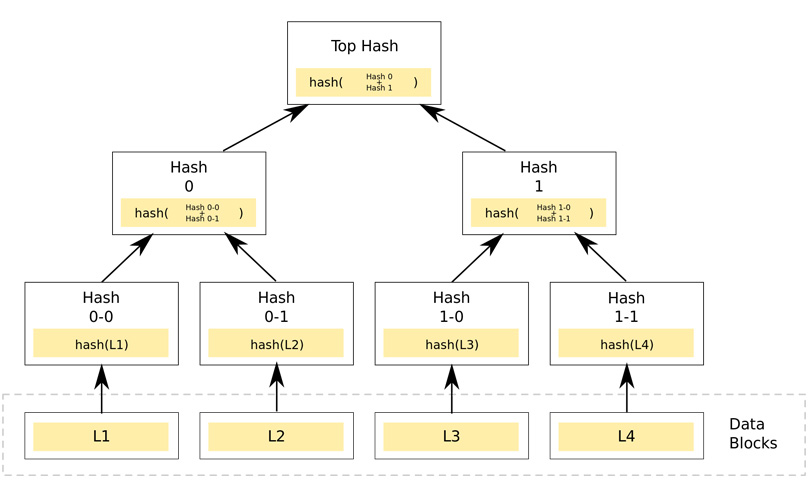
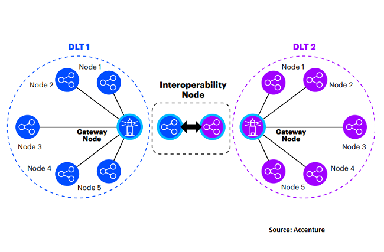

Bu yazıda Blockchain birlikte çalışabilirliğine değineceğiz. Detaylara girmeden Blockchain neydi bir hatırlayalım, konumuz "Interoperability" olduğu için fazla hızlıca geçelim.

## Blockchain

En temel düzeyde, blockchain tam anlamıyla sadece bir blok zinciridir, ancak fiziksel bir zincir değil tabii. Bu bağlamda “blok” ve “zincir” kelimelerini söylediğimizde, aslında halka açık bir veritabanında (zincir) saklanan dijital bilgilerden (blok) bahsediyoruz. Bir blok zinciri, kriptografi kullanılarak bağlanan blok adı verilen, büyüyen bir kayıt listesidir. Her blok, önceki bloğun şifreleme imzasını, bir zaman damgasını ve işlem verilerini (genellikle bir Merkle ağacı olarak temsil edilir) içerir.

Tasarım gereği, blockchain'de veriler değiştirilmeye karşı koruma altındadır. Halk arasında 'İki taraf arasındaki işlemleri verimli ve doğrulanabilir ve kalıcı bir şekilde kaydedebilen açık, dağıtılmış bir defter' diye de bilinir. Dağıtılmış bir defter olarak kullanımda, bir blockchain düğümler arası iletişim için bir protokol kullanarak yeni blokları doğrulayan direk iletişim kullanan bir ağ tarafından yönetilir. Bir kez kaydedildikten sonra, herhangi bir bloktaki verilerin değişmesi ağ çoğunluğunun onayını gerektirir ve sonraki tüm bloklar değiştirilmeden geriye dönük olarak değiştirilemez. Blockchain kayıtları değiştirilemez olsa da, blok zincirleri tasarım olarak güvenli kabul edilebilir ve [yüksek Bizans hata toleransına](https://en.wikipedia.org/wiki/Byzantine_fault_tolerance) sahip dağıtık bir bilgi işlem sistemini olarak kabul edilir.

## Blockchain Birlikte Çalışabilirliği

Blockchain teknolojisinin ortaya çıkması, özellikle tedarik zinciri organizasyonları için büyük umut vaat ediyor. Bununla birlikte, blockchain birlikte çalışabilirliği konusundaki sıkıntılar kullanımın önünde bir engel oluşturabilir. Dağıtık Web 3.0'ı gerçeğe dönüştürmek için, tüm blockchain ağları birbirleriyle etkileşime girebilmelidir. Birlikte çalışabilirlik burada da hayati bir role sahip.

Tipik bir tedarik zinciri düşünün. Tedarik zinciri operasyonlarını ve diğer günlük aktiviteleri yönetmek için bir ERP sisteminiz olabilir, belki işletme sermayesini yönetmek için bir varlık yönetim platformu, bankanız ticari faaliyetlerinizi finanse etmek için bir portal sağlayabilir, hatta sistem bir blockchain üzerinde koşuyor olabilir.

Ancak lojistik sağlayıcılarınız tamamen farklı bir teknoloji kullanarak veya sadece tedarik zinciri boyunca dijital belgelere geçerek küresel bir “takip ve izleme” çözümü sunuyor. Bu çözümlerin her biri tedarik zincirinin bir bölümünde verimliliği artırabilir, ancak - kurumsal blok zincirinin çözmek istediği yegane sorun olan - kendimizi tedarikçilerimizin ve ortaklarımızın dayattığı teknoloji seçimleri ile sınırlayamayız (vendor lock).

Birlikte çalışma için gerekli başlıca maddeler:

* Varolan sistemler ile **entegrasyon**
* Diğer ağlarda **işlem başlatabilmek**
* Farklı zincir teknolojisini kullanan diğer teknolojiler ile işlem yapabilmek (**interchain**)
* Aynı zincir teknolojisini kullanan diğer dağıtımlar (uygulamalar) ile işlem yapabilmek (**intrachain**)
* Bir platform ya da teknolojiyi kullanmaktan vazgeçtiğimizde kolay ve sorunsuz geçiş yapabilmek (**interchange**)

Bir uçak imalat şirketi olduğunuzu düşünün. Düzinelerce ülkede binlerce tedarikçiniz, yüzlerce bankacılık ortağınız ve lojistik sağlayıcınız var. Her yıl milyonlarca parçanın zamanında teslimine bağımlısınız. Fiziksel ve finansal tedarik zincirinin her adımında, tedarik ve sipariş yönetimindeki kağıt süreçlerinde verimlilik kazanımları sağlayabilen, borç ve alacak işlemlerini hızlandırarak işletme sermayesi iyileştirebilen, lojistik tedarik zincirindeki izleme ve takip kabiliyetleri ile riskin azaltan blockchain uygulamaları bulunmakta. Yazdığımız maddeleri bu şirket için ele alalım:

### Entegrasyon

Bir blockchain ağı size gerçek zamanlı tedarik zinciri finansmanı sağlayabilir. Bu acil finansman seçeneklerine doğrudan bu yeni ağlarla sorunsuz bir şekilde entegre edilmesi gereken ERP sisteminiz üzerinden erişmek isteyebilirsiniz.

### İşlem Başlatabilmek

Ödeme yapma zamanı geldiğinde, mevcut ödeme sistemleri işi zaten yapabiliyorken neden tekerleği yeniden icat edesiniz? SWIFT gibi mevcut ödeme ağlarında ödemeleri başlatabilmelisiniz.

### Interchain

Başka yerlerde, lojistik sağlayıcılarınız nakliye yaşam döngüsünde görünürlüğü artırmak için başka ağlar kullanıyor olabilir. Finansman ağınızdaki verilerin ve bu lojistik ağlardan gelen gönderim verilerinin zincirler arası paylaşılabilmesi harika olmaz mıydı?

### Intrachain

Akreditifleri yönetmek için de bir blockchain uygulaması kullanmak isteyebilirsiniz. Aynı temel teknolojiyi kullanan iki veya daha fazla blockchain uygulamasını entegre ederken elde edeceğiniz ek avantajlar olabilir - bu nedenle, temel platformunuz bunları kolaylaştırmak için tasarlandıysa, zincir içi senaryoları da aktif olarak düşünmeniz gerekir.

### Interchange

Ve son olarak, uygulama sağlayıcınızın veya kendi blockchain girişiminizin farklı bir platform dağıtmanızı istemesi olabilir mi? Birini diğeriyle değiştirebilir miyiz?

## Nasıl peki

Farklı yöntemler vardır: çapraz zincirler (cross-chains), yan zincirler (sidechains), proxy belirteçleri (proxy tokens), takaslar (swaps) vb..

Mevcut blok zincirlerini birbirine bağlamak kolay bir iş değildir. ConsenSys’in konuyla ilgili araştırmasına göre, “Ticarileşme, geliştiricileri ve girişimcileri müşterileri için en iyi olan sistemleri oluşturmayı hedefleyerek rekabeti ve yeniliği teşvik ediyor”. Sonuç olarak, açık kaynak birlikte çalışabilirliği göz ardı ediliyor ve çoğu blok zincirinin onu destekleyecek yerleşik özellikleri bulunmuyor.

Bununla birlikte, bazı blok zincir projeleri, farklı yaklaşımlar kullanarak birlikte çalışabilirliğe odaklanmıştır. İşte bazı örnekler:

### Polkadot

Polkadot çok zincirli veya çapraz zincir teknolojisidir. Temel olarak, farklı blok zincirlerinin daha büyük, standart bir ekosisteme bağlanmasına izin verir. Ethereum'un kurucu ortağı Gavin Wood tarafından kurulmuştur.

Teknik olarak, Polkadot parachainlerden (yani işlemleri yapan ve orijinal blok zincirine aktaran paralel blok zincirleri), bir röle zincirinden (yani, parachainleri bağlayan ve güvenliğini sağlayan merkezi bir bileşen) ve Polkadot'u harici blok zincirlerine bağlayan köprülerden oluşur.

### Cosmos

Kozmos da çapraz zincir prensibini takip eder. Özellikle, blockchain birlikte çalışabilirliğini sağlamak için bloklar arası iletişim (IBC) protokolü kullanır. Blok zincirleri için TCP/IP benzeri bir mesajlaşma protokolü olarak hizmet eder. Çeşitli yerleşik blok zincirleri (Bitcoin gibi) IBC'yi varsayılan hali ile desteklemediğinden, Cosmos onları “Cosmos Hub” a bağlamak için “Peg Zone” kullanıyor. Tüm bunları bağlayan bir “amiral gemisi” blok zinciri standart diller aracılığıyla aralarındaki iletişimi koordine eder.

Bununla birlikte, Cosmos Hub, Cosmos tarafından geliştirilen ve diğer varlıkları içerebilen daha büyük zincirler arası ekosistemin bir parçasıdır - örneğin, kurumsal müşteriler ve Çinli müşterilere odaklanan bir de Iris Hub vardır.

### Chainlink

Chainlink, merkezi olmayan bir Oracle hizmetidir. Verilerin zincir dışı API'lerden alınmasına ve bir blok zincirine konulmasına izin verir. Başka bir deyişle, Chainlink blok zincirleri ve zincir dışı mevcut tüm altyapı arasında bir köprü görevi görür: Oracle düğümleri gerçek dünya verilerini alır, ağ üzerinden işler ve blok zincirine alır. Özellikle, dünyadaki çoğu banka tarafından kullanılan küresel bankalararası veri transferi ve ödeme sistemi SWIFT ile işbirliği yapmaktadır.

### Wanchain

Wanchain, başka türlü bağlanmamış blok zincirleri arasında veri aktarımını kolaylaştırmak için farklı bir protokol kullanır. Böylece, Wanchain Peg bölgelerini veya çok kanallı analoglarını dağıtmak yerine, diğer blok zincirlerinde alınıp satılabilen “sarılmış (wrapped)” jetonlar oluşturur.

Örneğin, 10 ETH'yi BTC zincirine taşımak için, platform önce Ethereum blok zincirindeki bu ETH miktarını akıllı sözleşmelerle kilitleyecek ve daha sonra Wanchain'de 10 Wanchain sarılı ETH'yi (WETH) haline getirir. Bu WETH daha sonra bir ticaret platformunda Wanchain ile sarılmış BTC (WBTC) için takas edilebilir. Bu sarılmış BTC tokenleri daha sonra Bitcoin blok zincirinde bulunan orijinal tokenlere dönüştürülebilir.

## Veri Paylaşımı

Başarılı bir birlikte çalışabilme için, blockchain platformlarının verileri diğer platformlarla iletişim kurma ve paylaşma yeteneğine sahip olması gerekiyor. BoF (Business of Fashion), birlikte çalışabilir platformlardan oluşan az sayıda küresel ağın, blockchain endüstrisi için “Değerli Bir Ağın omurgası” olacağına inanıyor.

Teknik çözümler üzerinde çalışmalar devam ederken, BOF birlikte çalışabilirliği sağlamak için iki yaklaşım önermektedir:

* İşlemleri ve bilgileri doğrulamak için üçüncü taraf bir 'zincir dışı varlık' kullanma. Bu taraf, platformlar arasında bilgi transferinden veya noter servisi gibi farklı platformların durumunu kaydetmekten sorumlu olacaktır, böylece her katılımcı bilgiye güvenebilir.
* Bu bilgileri doğrulamak için çapraz blok zincir köprüleri ve akıllı sözleşmeler kullanarak doğrudan blockchain arasında bilgi paylaşımı.

GDPR uyumluluğu teknoloji ile ilgili değildir, teknolojinin nasıl kullanıldığı ile ilgilidir. Tıpkı GDPR uyumlu internet veya GDPR uyumlu yapay zeka algoritması olmadığı gibi, GDPR uyumlu bir blockchain teknolojisi diye bir şey yoktur. Yalnızca GDPR uyumlu kullanım örnekleri ve uygulamaları vardır.

Diğer konuların yanı sıra, birçok GDPR gereksinimlerinin yorumlanması ve uygulanması özel Blockchain uygulamalarında halka açık olanlardan daha basittir. Ancak açık ağlar hayatımızda kalacak gibi görünüyor ve çok önemli bir alandaki sorunları çözmek için buradalar. Dünya çapında internetin son yirmi yılda yaptığı gibi istihdam yaratma ve gelişen şirketler oluşturma potansiyeline sahip.

Gdpr ve blockchain arasındaki gerilim esas olarak üç konu etrafında dönüyor:

* **Veri denetleyicilerinin ve işlemcilerinin tanımlanması ve yükümlülükleri:** Veri denetleyicilerinin ve veri işlemcilerinin tanımlanabildiği ve yükümlülüklerini yerine getirebileceği birçok durum olsa da, özellikle veri zinciri tarafından blok zinciri işlemleri yazıldığında bir veri denetleyicisini tanımlamanın zor ve belki de imkansız olduğu durumlar da vardır.
* **Kişisel verilerin anonimleştirilmesi:** Kişisel verilerin ortaya çıkan çıktının potansiyel olarak bir blockchain ağında saklanabileceği noktada anonimleştirilmesi için ne yapılması gerektiği konusunda yoğun tartışmalar sürüyor ve şu anda bir fikir birliği yoktur. Bir örnek vermek gerekirse, verilerin karmalanması (hash) birçok durumda anonimleştirme tekniği olarak kabul edilemez ve yine de zincir dışı olarak saklanan benzersiz dijital veri imzaları oluşturmak için karma kullanımının potansiyel olarak bir blok zincirinde akla geldiği durumlar vardır.
* **Bazı veri sahibi haklarının kullanılması:** Kişisel veriler bir blockchain ağına kaydedilirse, bunları düzeltmek veya kaldırmak zor olabilir. Blok zincirleri bağlamında silme olarak neyin düşünülebileceğini tanımlamak için tartışılmalar sürmektedir.

Açıkçası, bu konular veri koruma yetkilileri, Avrupa Veri Koruma Kurulu (EDPB) veya mahkeme tarafından kesin olarak çözülmemiştir. Regülatörlerin blockchain teknolojisinin her kullanım durumunu ve GDPR'in çeşitli yorumlarının Avrupa ekosistemi üzerindeki etkisini derinlemesine anlamaları zaman almaktadır.

Bu arada, girişimciler ve yenilikçiler için değerlendirebilecekleri dört ana ilke tavsiye ediliyor:

1. Büyük resim ile başlayın: kullanıcı değeri nasıl oluşturulur, veriler nasıl kullanılmış ve gerçekten blockchain'e ihtiyacınız var mı?
2. Kişisel verileri bir blockchain'de saklamaktan kaçının. Verileri anonimleştirmek için veri gizleme, şifreleme ve toplama tekniklerinden tam olarak yararlanın.
3. Kişisel verileri zincir dışı tutun veya blok zincirinden kaçınılamıyorsa, izin verilen özel blockchain ağlarında toplayın. Özel blok zincirlerini halka açık olanlara bağlarken kişisel verileri dikkatlice düşünün.
4. Yenilik yapmaya devam edin ve kullanıcılarla mümkün olduğunca açık ve şeffaf olun.

Blockchain uygulama geliştiricilerinin GDPR'a uymasını kolaylaştırmak için birçok umut verici araştırma ve geliştirme çalışması var. Daha da heyecan verici bir şekilde, blockchain'in GDPR desteklemek için nasıl kullanılabileceğini araştıran birçok proje görüyoruz.

Merkezi olmayan sistemlerde kişisel verilerin sağlam bir şekilde korunmasını sağlamanın yollarını bularak Avrupa, yukarıda bahsedilen sıkıntı ve engelleri çok daha erdemli bir güvenli bilgi çemberi ile değiştirebilir.

## Doğuş Teknoloji ve Blockchain Birlikte Çalışabilirliği

Öncelikle hangi alanlarda Blockchain ve birlikte çalışabilirlikten faydalanabileceğimize bakalım.

### Varlık Yönetimi

Somut, soyut ve karmaşık varlıkların yönetimi, blockchain teknolojisinin entegrasyonu ile hızla daha verimli hale geliyor. Gayrimenkul gibi varlıklar - genellikle likidite ve yatırım büyüklüğü ile daraltılmış - minimum operasyonel kayıp, yönetim maliyeti ve güvenlik kaygılarıyla token hale getirilebilir, bölünebilir ve dağıtılabilir. Varlık yöneticileri ve yeni yatırımcılar, ortaya çıkan likidite ve transfer dinamikleriyle fırsatların kilidini açabilir.

### Merkezi Olmayan Finans

Merkezi olmayan finans (DeFi) küresel vatandaşlar için anlatılmayan miktarda ekonomik fırsatın kilidini açarak daha kârlı, eşitlikçi ve güvenli bir küresel ekonomi sağlar. DeFi, likidite ve büyüme fırsatlarının kilidini açmak, finansal güvenliği ve şeffaflığı artırmak ve entegre ve standartlaştırılmış bir ekonomik sistemi desteklemek için Ethereum blok zincirinin temel ilkelerinden yararlanır.

### Ödemeler ve Para

Blockchain teknolojisi, parayı yönetmek ve ödemeleri kolaylaştırmak için tamamen yeni yollar sağlar. Havale işlemlerinden mikro kredilere ve daha fazlasına kadar, blockchain teknolojisi daha verimli ve güvenli bir küresel ödeme altyapısı oluşturuyor. Kullanılmayan değerdeki trilyonlarca dolar, mali güçlendirme ve operasyonel verimlilik yoluyla açılmayı bekliyor.

### Oylama

Seçimler demokrasinin belkemiği olarak işlev görür. Ancak oylama sistemlerinin güvenliği yıllar boyunca sorgulandı ve eleştirildi. Aslında, ihlallere ve saldırılara açık olan merkezi sunucuların varlığı, seçimlerin meşruiyetini zayıflatmaya başladı. Blockchain teknolojisi uygulamasıyla, tüm oylama süreci şifrelenebilir ve şeffaf hale getirilebilir. Dijital oylamanın rahatlığı, çift oylama, oy değiştirme ve oy silme gibi sorunları ortadan kaldırmak için blockchain'in değişmezliğiyle birleştirilmiştir.

### Sağlık hizmeti

Blockchain teknolojisi, sağlık sektörüne ince ama faydalı şekillerde nüfuz ediyor. Tıbbi Nesnelerin İnterneti'nin (IoMT) ve yapay zeka uygulayan tıbbi muayene sistemlerinin hızla ortaya çıkmasıyla, blockchain teknolojisi uygulamaları yakında birlikte çalışabilirliği, veri taşınabilirliği, bütünlüğü ve güvenliği ile sağlık hizmetinde devrim yaratacak. Bu dağıtılmış defter teknolojisinin büyük potansiyeli, tıbbi verilerin merkezsizleştirilmesiyle ilgili zorlukları ele almak için uygundur. Ek olarak, klinik denemeler, uyum ve düzenleme, tıbbi ve sağlık kayıtları dahil olmak üzere üç ana alanın blockchain veritabanı teknolojisinden faydalanması beklenmektedir.

### Besin Güvenliği

Gıda güvenliği için blockchain? Teknoloji uzmanları, blockchain teknolojisinin karmaşık bir çiftçi, broker, distribütör, işlemci, perakendeci, düzenleyici ve tüketici ağı üzerinden tüm veri yönetimi süreçlerini yenileyebileceğine inanıyor. Geçen yıllara bakarsak, kötü bir yiyecek grubunun restoran zincirlerinin ve gıda işletmelerinin kapanmasını sebep olduğu olayların bir bölümünü kolayca engellenebilir. Çin’in 2008 yılındaki bebek sütü skandalı ve 2006’da Kuzey Amerika’nın E. Coli salgını buna örnektir. Şu anda, gıda endüstrisi şeffaflık ve güvenden yoksundur, bu da tedarik zincirinde işlerin yanlış gittiği noktayı kesin olarak belirlemeyi zorlaştırır. Blockchain'in hesap verebilirliği ve izlenebilirliği sayesinde, tüketiciler yiyeceklerini çiftlikten çatala kadar kolayca izleyebilirler. Dahası, düzenleyicilerin gıda kaynaklı hastalıkların kaynağını tespit etmesi ve bunlarla başa çıkması kolay olacaktır ve aynı zamanda gıda üreticileri arasında sorumluluğu da desteklemektedir.

### Siber güvenlik

Veri ihlali sayısı artıyor ve tüketiciler için sürekli bir tehdit oluşturuyor. Kimlik Hırsızlığı 2018 Ponemon raporunda “veri ihlalinin ortalama toplam maliyeti 3,86 milyon dolar ve güvenlik otomasyonu kullanan kuruluşlar için ortalama ihlal maliyetinde azalma 1,55 milyon dolar” olarak belirtiliyor. Veri ihlallerinde ve bilgisayar korsanlıklarındaki bu rahatsız edici artış eğilimi, kuruluşları kötü niyetli aktör metodolojilerine uyacak şekilde güvenlik çözümlerini yükseltmeye zorladı. Ama bu yatırımlar değerli mi? Karşı saldırı başlatmada etkili midir? Öyle görünmüyor çünkü saldırganlar kazanıyor ve tehditler gelişiyor. Peki blockchain bu saldırıları ve hırsızlıkları nasıl önleyebilir? Bu teknolojinin siber güvenliği artıran üç ana özelliği vardır - ademi merkeziyetçilik, kriptografik güvenlik ve kurcalamaya dayanıklı defterler. Eşler arası ağ üzerindeki sıkı şifreleme ve veri dağıtım protokolleri, verilerin güvenli bir şekilde sağlam ve bilgisayar korsanlarının erişemeyeceği bir yerde kalmasını sağlar.

### Emlak

Emlak dijital varlıklarının yarattığı fırsatların kilidini açmak için blockchain'den yararlanılabilir. Yeni iş modelleri oluşturmak, gayrimenkulün temel operasyonlarını geliştirmek, maliyetleri azaltmak, veri silolarını en aza indirmek ve şeffaflığı artırmak için yatırım yapılabilir.

---

Doğuş Teknoloji bir yazılım geliştirme merkezi olarak görüldüğünde, bu alternatiflerin hepsi aslında bizim için bir iş alanı olarak kabul edilebilir. Bu tür geliştirmelerin kalbinde yer alan konu ise:

### Akıllı Sözleşmeler (Smart Contracts)

Akıllı sözleşmeler fikrini ilk kez öneren Amerikalı bilgisayar bilimcisi Nick Szabo'ya göre, bu, “sözleşme şartlarını yerine getiren bilgisayarlı bir işlem protokolüdür”. ‘Sözleşme’yi duyduğunuzda, farklı taraflar arasındaki yasal bir anlaşmanın ayrıntılarını özetleyen imzalı bir kağıt düşünürsünüz. Blockchain tabanlı akıllı sözleşmeler, bir blockchain ağına bağlı birkaç düğüm tarafından denetlenen bilgisayarlı işlem protokolü üzerinde çalışan dijital sözleşmelerdir. Blockchain sözleşmeleri, izin verilen tüm taraflar arasında merkezi olmayan bir sistem üzerinde çalıştığından, kendi kendine idam edebilir ve kendi kendini koruyabilir, böylece avukatlar veya noterler gibi aracılara olan ihtiyacı ortadan kaldırabilir. Geleneksel sistemlerin aksine, akıllı sözleşmeler şeffaf, izlenebilir, güvenli ve geri döndürülemez, bu yüzden birkaç endüstri onlara yöneliyor.

---

İlk başlangıç noktamız Akıllı Sözleşme kavramını iyi anlayıp, sınırlarını öğrenmek olmalı.

Şirket olarak yukarıdaki konularda müşteriler için yapabileceğimiz geliştirmelerin ötesinde kendi içimizde zimmet takibi, tedarikçi ödemelerimiz, müşterilerimiz ile sözleşme trafiğimizin takibi gibi konularda da Blockchain kullanımını deneyebiliriz.

## Referanslar

* [https://en.wikipedia.org/wiki/Blockchain](https://evrimagaci.org/sinirbilim-ve-beyin-4-noronlar-nasil-calisir-)
* [https://medium.com/@finartz_com/en-basit-tabirle-blockchain-nedir-nasıl-çalışır-f9572b299c7b](https://medium.com/@finartz_com/en-basit-tabirle-blockchain-nedir-nasıl-çalışır-f9572b299c7b)
* [https://cointelegraph.com/explained/blockchain-interoperability-explained](https://cointelegraph.com/explained/blockchain-interoperability-explained)
* [https://www.forbes.com/sites/richardgendalbrown/2020/02/13/the-five-ingredients-of-blockchain-interoperability/#3bf1b94158a1](https://www.forbes.com/sites/richardgendalbrown/2020/02/13/the-five-ingredients-of-blockchain-interoperability/#3bf1b94158a1)
* [https://www.itransition.com/blog/blockchain-interoperability](https://www.itransition.com/blog/blockchain-interoperability)
* [https://www.coindesk.com/one-network-many-chains-the-case-for-blockchain-interoperability](https://www.coindesk.com/one-network-many-chains-the-case-for-blockchain-interoperability)
* [https://www.linklaters.com/en/insights/blogs/fintechlinks/2019/march/eu-blockchain-observatory-recommends-how-to-improve-scalability-interoperability](https://www.linklaters.com/en/insights/blogs/fintechlinks/2019/march/eu-blockchain-observatory-recommends-how-to-improve-scalability-interoperability)
* [https://www.eublockchainforum.eu/sites/default/files/reports/20181016_report_gdpr.pdf](https://www.eublockchainforum.eu/sites/default/files/reports/20181016_report_gdpr.pdf)
* [https://blog.chain.link/interoperability-and-connectivity-unlocking-smart-contracts-3-0-2/](https://blog.chain.link/interoperability-and-connectivity-unlocking-smart-contracts-3-0-2/)
* [https://consensys.net/blockchain-use-cases/](https://consensys.net/blockchain-use-cases/)
