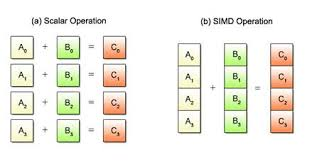
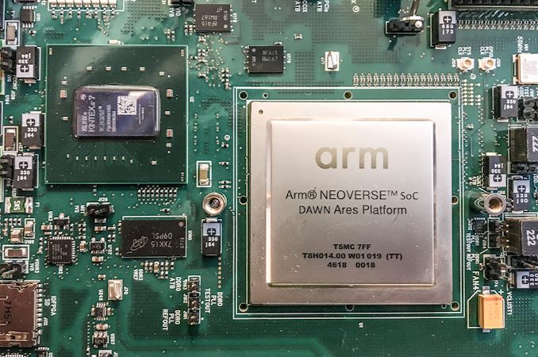
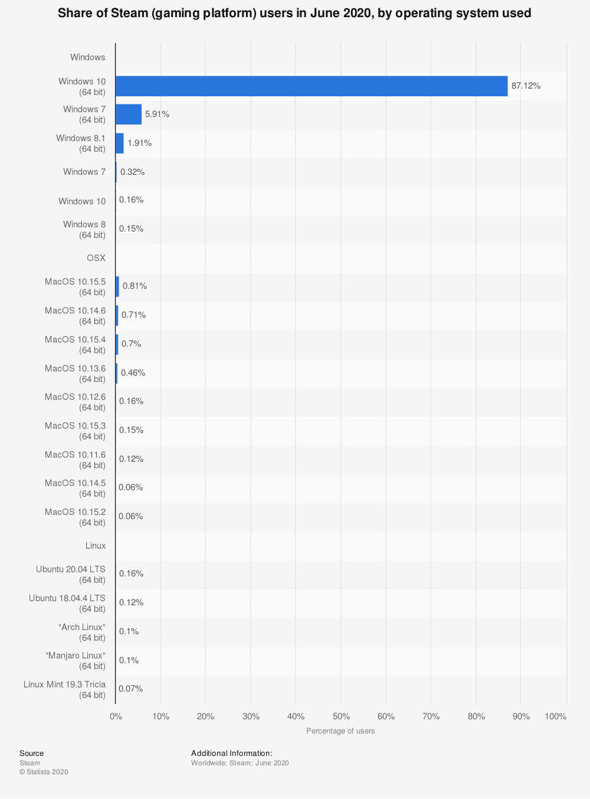

Bir programlama dili kullanarak yazdığımız kodları (genelde) işlemciler çalıştırıyor. Peki biz işlemcileri ne kadar tanıyoruz? Yeteneklerini ne kadar kullanıyoruz?


Konuların derinlerine inmeyi, bir şeyi kullanmaktan öte nasıl çalıştığını anlamaya çalışmayı çok severim. İtiraf edeyim, bazen mikro optimizasyon da yapıyorum, sınırları zorlamak için ve genellikle hobi projelerimde. [Bildiğiniz kumdan yapılan](https://bit-tech.net/reviews/tech/cpus/how-to-make-a-cpu-from-sand-to-shelf/1/) işlemciler hakkında ne zaman bir yazı okusam aklıma programlama dillerinin neden bize bu yetenekleri sunmadığı düşüncesi geliyor. Yakın bir zamanda gördüğüm [bu makaleden](https://devblogs.microsoft.com/dotnet/hardware-intrinsics-in-net-core/) sonra ben de bu konuda biraz karalamak istedim.

Intel'in işlemci üretimi [bayağı geçmişe](https://en.wikipedia.org/wiki/List_of_Intel_microprocessors#The_4-bit_processors) dayanıyor. Ancak x86 mimarisini başlatan 8086 esas devrimin temelini attı. Özellikle [VME](https://en.wikipedia.org/wiki/Virtual_8086_mode) ile modern işletim sistemlerinin doğmasını sağladı.


Peki biz kodlama yaparken bu işlemcilerin hangi özelliklerini kullanıyoruz? Şöyle bir düşünelim, herhangi bir programlama dilinin dokümantasyonunu hatırlayın. Değişken tanımlama, döngüler, structlar, (varsa) sınıflar, matematiksel işlemler vs.. Hep aynı konular, birisinde interface varken diğerinde trait oluşturuyoruz. Birisinde async varken diğerinde callback ile çalışıyoruz. Birinde pointer var diğerinde referanslar var. Bazıları belleği bizim için yönetiyor, diğerlerinde referans takip etmek üzere bize büyük iş düşüyor.


Ancak işlemciler bir çoğumuzun bilmediği ya da hiç kullanmadığı çok daha fazlasını yapabilen eklentilere sahipler, [tam liste burada](https://en.wikipedia.org/wiki/Processor_supplementary_capability). Hem de bildiğim en eskisi olan [MMX](https://en.wikipedia.org/wiki/MMX_(instruction_set)) ile 1996 yılından beri. MMX bir SIMD (Single Instruction, Multiple Data) yani tek komut-çok işlem eklentisi. 


Bu eklentiler genelde kendi [register](https://en.wikipedia.org/wiki/Processor_register)'larına sahipler. Genelde işlemci register'ları işlemcinin çalışma bit genişliği ile aynı olur, 16 bit için 16 bit gibi. Ancak MMX 64 bitlik kendi register'larına sahip. Yani 4 adet 16 bitlik sayı tutabiliyor. İki tane 4 elemanlık dizideki elemanları karşılıklı toplayıp yeni bir dizi oluşturabiliyor.

```javascript
const a1 = [1, 3, 5, 7]
const a2 = [2, 4, 6, 8]
const a3 = []
for (let i = 0; i < 4; i++) {
    a3.push(a1[i] + a2[i])
}
```
<sub>Yukarıdaki kodda bilerek imperatif bir yol izledim, ```map``` gibi bir fonksiyon kullansam tam anlatmak istediğimi vurgulayamayacaktım<sub>

Toplama işlemimizi bir döngü içinde yaptık, büyük ihtimalle kodumuz her döngü adımında klasik register'lara (EAX gibi) verileri yükleyecek ve ADD komutu ile verileri toplayacak. Sonuçları da EBX ev ECX kullanarak hesapladığı hedef bellek adresine yazacak. Bildiğiniz bir sürü iş var burada.


<sub>http://mirror.as43289.net/kernel/people/geoff/cell/ps3-linux-docs/CellProgrammingTutorial/BasicsOfSIMDProgramming.html</sub>

SIMD kullanarak bu işi tek bir komuta indirebiliyoruz.

Tabii ne gerek var diyebilirsiniz, bu konuda kimseyi ikna edebileceğimi sanmıyorum çünkü günlük geliştirmelerimizde büyük oranda bu seviyede optimizasyona ihtiyacımız olmuyor. Genelde oyun geliştiricileri (uzun yıllardır bu işleri de GPU devraldı), görüntü işleme, karışık matematiksel işlemler gibi işlerle uğraşanlar zaten biliyordur.


<sub>https://xkcd.com/303/</sub>

Tam burada önemli bir noktaya değinmek lazım. Günümüzde derleyiciler çok akıllandı. Recursive fonksiyonlarda [Tail Call Optimizasyonu](https://en.wikipedia.org/wiki/Tail_call)'nu otomatik yapanlar, veri komşuluğunu ve önbellek kullanım oranını arttırmak için kod sıralamamızı yeniden düzenleyenler bulunmakta. Genelde uygulanan optimizasyonlar için [şu listeye](https://en.wikipedia.org/wiki/Category:Compiler_optimizations) bakabilirsiniz. Bu yazıda değindiğim SIMD çağrılarının sizin için otomatik yapılmadığını garanti edemem, belki onu da yapanlar vardır. Özellikle C#, Java gibi yönetilen (managed) dillerden şüpheleniyorum. Tam zamanında derleme (JIT Compilation) statik kod üretimine göre büyük avantajlara sahip, ellerindeki çalışma zamanı verileri bu optimizasyonu yapmalarını sağlayabilir.



Şunu da eklemek lazım, her işlemci bu eklentilerin her birini desteklemiyor. Dolayısı ile bu özellikleri biraz zorlayarak da olsa kullanabildiğimiz dillerde platform kontrolü yapmamız gerekiyor. Genellikle bu derece optimize edilen fonksiyonlar bir kontrol yapıp ortam uygun değilse SIMD kullanmak yerine klasik x86 komutlarını çağırıyorlar. Yani bir ```if``` kontrolü başarısız olursa yukarıdaki gibi bir döngü çalışıyor.

Belki de bu sorun çoklu platform destekleyen dillerin SIMD kullanımını standart kütüphanelere eklememe sebepleri olabilir.

## Dotnet Core ve SIMD


Daha fazla uzatmadan konumuza gelelim. .Net Core 3.0 ile bu özellikleri nasıl kullanabilceğimizi görelim. Aslında .Net ve SIMD konusu [pek yeni sayılmaz](https://devblogs.microsoft.com/dotnet/the-jit-finally-proposed-jit-and-simd-are-getting-married/), 2014 yılında devrimsel RyuJIT derleyicisi ile bu yeteneği eklemişlerdi.

```csharp
// Dizi yerine Vector

Vector<float> values = GetValues();
Vector<float> increment = GetIncrement();

// İki vektörü SIMD ile topluyoruz

Vector<float> result = values + increment;
```

.Net ile gelen SIMD yenilikleri mümkün olduğunda donanım özelliklerini kullanırken işlemci desteği olmayan ortamlarda çalışabilecek kodları da içeriyor (Software Fallback).

.Net Core 3.0 ile eklenenler ise yazılım desteği içermiyor, bir fallback olmadığı için çağıracağımız komutların işlemci tarafından desteklendiğini bizim kontrol etmemiz gerekiyor. Tabii çalışma ortamı tamamen bizim kontrolümüzdeyse ve zaten bu özellikleri içerdiğinden eminsek kontrol etmeden de kullanabiliriz.

İlk adımımız ```System.Runtime.Intrinsics``` altından ortamımıza uygun olanı eklemek, ben x86 üzerinde çalışan bir Mac kullanıyorum, yani ```System.Runtime.Intrinsics.X86``` namespace ekliyorum.

Platforma özel namespace'ler altında işlemci eklentileri komut setleri (Instruction Set Architecture - ISA) şeklinde gruplanmış durumda. Her sınıf da ```IsSupported``` property'si ile desteklenme durumunu kontrol edebilmemizi sağlıyor. Bu sınıfların altında da ```X64``` isimli subclass bulunduğunu görebilirsiniz. Yani sınıflar varsayılan olarak 32 bit işlemciler için yazılmışken 64 bit işlemciler için ayrı sınıf kullanmak gerekiyor. 64 bit işlemciler 32 bit işlemleri geri uyumluluk adına destekliyor ancak 64 bit ile çalışmanın performansa etkisi olacaktır.


<sub>https://www.statista.com/statistics/265033/proportion-of-operating-systems-used-on-the-online-gaming-platform-steam/</sub>

<sub>Kullanıcıların donanım özelliklerini takip eden Steam platformunun verilerine bakarsak çok büyük oranda 64 bit sistemlerin kullanıldığını görebiliriz.</sub>

Bu durumda 64 bit SSE2 için ```System.Runtime.Intrinsics.X86.Sse2.X64``` sınıfını kullanmamız gerekiyor. Ortam desteğini de ```System.Runtime.Intrinsics.X86.Sse2.X64.IsSupported``` statik değişkeni ile kontrol edebiliriz.

## Örnek Yapalım

En basit örnek bir dizi elemanlarını toplamak, gerçek dünya kullanımları hayal gücümüze bağlı.

```csharp
static int Sum (ReadOnlySpan<int> source) {
    var result = 0;

    for (var i = 0; i < source.Length; i++) {
        result += source[i];
    }

    return result;
}
```

| Method | Count | Mean          | Error       | StdDev     |
|--------|-------|---------------|-------------|------------|
| Sum    | 1     | 2.477 ns      | 0.0192 ns   | 0.0179 ns  |
| Sum    | 2     | 2.164 ns      | 0.0265 ns   | 0.0235 ns  |
| Sum    | 4     | 3.224 ns      | 0.0302 ns   | 0.0267 ns  |
| Sum    | 8     | 4.347 ns      | 0.0665 ns   | 0.0622 ns  |
| Sum    | 16    | 8.444 ns      | 0.2042 ns   | 0.3734 ns  |
| Sum    | 32    | 13.963 ns     | 0.2182 ns   | 0.2041 ns  |
| Sum    | 64    | 50.374 ns     | 0.2955 ns   | 0.2620 ns  |
| Sum    | 128   | 60.139 ns     | 0.3890 ns   | 0.3639 ns  |
| Sum    | 256   | 106.416 ns    | 0.6404 ns   | 0.5990 ns  |
| Sum    | 512   | 291.450 ns    | 3.5148 ns   | 3.2878 ns  |
| Sum    | 1024  | 574.243 ns    | 9.5851 ns   | 8.4970 ns  |
| Sum    | 2048  | 1,137.819 ns  | 5.9363 ns   | 5.5529 ns  |
| Sum    | 4096  | 2,228.341 ns  | 22.8882 ns  | 21.4097 ns |
| Sum    | 8192  | 2,973.040 ns  | 14.2863 ns  | 12.6644 ns |
| Sum    | 16384 | 5,883.504 ns  | 15.9619 ns  | 14.9308 ns |
| Sum    | 32768 | 11,699.237 ns | 104.0970 ns | 97.3724 ns |

<sub>Benchmark projesi ile uğraşmak yerine hazır yapılmışları paylaşacağım.</sub>

Modern işlemciler tek bir thread üzerinde bile olsa [Instruction Pipelining](https://en.wikipedia.org/wiki/Instruction_pipelining) sayesinde tek bir cycle içinde birden fazla işlem yapabiliyorlar.

Bu işi JIT derleyici de yapabilir, ama garantiye almak için kendimiz yapabiliriz. [Loop Unrolling](https://en.wikipedia.org/wiki/Loop_unrolling) denilen bu yaklaşım ile işlemleri 4'erli gruplar ile yaparak Instruction Pipelining optimizasyonu yapmış oluyoruz.

```csharp
static unsafe int SumUnrolled (ReadOnlySpan<int> source) {
    var result = 0;
    var i = 0;
    var lastBlockIndex = source.Length - (source.Length % 4);

    // Pin source so we can elide the bounds checks
    fixed (int * pSource = source) {
        while (i < lastBlockIndex) {
            result += pSource[i + 0];
            result += pSource[i + 1];
            result += pSource[i + 2];
            result += pSource[i + 3];

            i += 4;
        }

        while (i < source.Length) {
            result += pSource[i];
            i += 1;
        }
    }

    return result;
}
```

| Method      | Count | Mean         | Error      | StdDev     |
|-------------|-------|--------------|------------|------------|
| SumUnrolled | 1     | 2.922 ns     | 0.0651 ns  | 0.0609 ns  |
| SumUnrolled | 2     | 3.576 ns     | 0.0116 ns  | 0.0109 ns  |
| SumUnrolled | 4     | 3.708 ns     | 0.0157 ns  | 0.0139 ns  |
| SumUnrolled | 8     | 4.832 ns     | 0.0486 ns  | 0.0454 ns  |
| SumUnrolled | 16    | 7.490 ns     | 0.1131 ns  | 0.1058 ns  |
| SumUnrolled | 32    | 11.277 ns    | 0.0910 ns  | 0.0851 ns  |
| SumUnrolled | 64    | 19.761 ns    | 0.2016 ns  | 0.1885 ns  |
| SumUnrolled | 128   | 36.639 ns    | 0.3043 ns  | 0.2847 ns  |
| SumUnrolled | 256   | 77.969 ns    | 0.8409 ns  | 0.7866 ns  |
| SumUnrolled | 512   | 146.357 ns   | 1.3209 ns  | 1.2356 ns  |
| SumUnrolled | 1024  | 287.354 ns   | 0.9223 ns  | 0.8627 ns  |
| SumUnrolled | 2048  | 566.405 ns   | 4.0155 ns  | 3.5596 ns  |
| SumUnrolled | 4096  | 1,131.016 ns | 7.3601 ns  | 6.5246 ns  |
| SumUnrolled | 8192  | 2,259.836 ns | 8.6539 ns  | 8.0949 ns  |
| SumUnrolled | 16384 | 4,501.295 ns | 6.4186 ns  | 6.0040 ns  |
| SumUnrolled | 32768 | 8,979.690 ns | 19.5265 ns | 18.2651 ns |

Küçük dizilerde biraz daha yavaş çalışan yeni kod 16 ve daha fazla kayıt olduğunda yavaş yavaş daha iyi sonuçlar üretiyor.

## Vektörü Görelim

Yaklaşımı comment'ler ile açıklamaya çalıştım.

```csharp
static int SumVectorT (ReadOnlySpan<int> source) {
    var result = 0;
    var vresult = Vector<int>.Zero;
    var i = 0;

    // vektör kaç adet int alabiliyor?
    // vektöre gruplu sığdırdığımız son eleman kim?
    var lastBlockIndex = source.Length - (source.Length % Vector<int>.Count);

    // gruplu halde vektörlere yerleştiriyoruz
    while (i < lastBlockIndex) {
        vresult += new Vector<int> (source.Slice (i));
        i += Vector<int>.Count;
    }

    // vektör gruplarını topluyoruz
    for (var j = 0; j < Vector<int>.Count; j++) {
        result += vresult[j];
    }

    // geri kalan elemanları da ekliyoruz
    while (i < source.Length) {
        result += source[i];
        i += 1;
    }

    return result;
}
```

Sonuçlar aşağıdaki gibi:

| Method     | Count | Mean         | Error      | StdDev     |
|------------|-------|--------------|------------|------------|
| SumVectorT | 1     | 4.517 ns     | 0.0752 ns  | 0.0703 ns  |
| SumVectorT | 2     | 4.853 ns     | 0.0609 ns  | 0.0570 ns  |
| SumVectorT | 4     | 5.047 ns     | 0.0909 ns  | 0.0850 ns  |
| SumVectorT | 8     | 5.671 ns     | 0.0251 ns  | 0.0223 ns  |
| SumVectorT | 16    | 6.579 ns     | 0.0330 ns  | 0.0276 ns  |
| SumVectorT | 32    | 10.460 ns    | 0.0241 ns  | 0.0226 ns  |
| SumVectorT | 64    | 17.148 ns    | 0.0407 ns  | 0.0381 ns  |
| SumVectorT | 128   | 23.239 ns    | 0.0853 ns  | 0.0756 ns  |
| SumVectorT | 256   | 62.146 ns    | 0.8319 ns  | 0.7782 ns  |
| SumVectorT | 512   | 114.863 ns   | 0.4175 ns  | 0.3906 ns  |
| SumVectorT | 1024  | 172.129 ns   | 1.8673 ns  | 1.7467 ns  |
| SumVectorT | 2048  | 429.722 ns   | 1.0461 ns  | 0.9786 ns  |
| SumVectorT | 4096  | 654.209 ns   | 3.6215 ns  | 3.0241 ns  |
| SumVectorT | 8192  | 1,675.046 ns | 14.5231 ns | 13.5849 ns |
| SumVectorT | 16384 | 2,514.778 ns | 5.3369 ns  | 4.9921 ns  |
| SumVectorT | 32768 | 6,689.829 ns | 13.9947 ns | 13.0906 ns |

Yukarıdaki kodda 16 baytlık vektörler kullanılıyor. Bir de ```Vector128``` ile görelim.

```csharp
static unsafe int SumVectorizedSse2 (ReadOnlySpan<int> source) {
    int result;

    fixed (int * pSource = source) {
        var vresult = Vector128<int>.Zero;

        var i = 0;
        var lastBlockIndex = source.Length - (source.Length % 4);

        while (i < lastBlockIndex) {
            vresult = Sse2.Add (vresult, Sse2.LoadVector128 (pSource + i));
            i += 4;
        }

        // eğer SSE3 destekleniyorsa daha da hızlı versiyonu kullanalım
        if (Ssse3.IsSupported) {
            vresult = Ssse3.HorizontalAdd (vresult, vresult);
            vresult = Ssse3.HorizontalAdd (vresult, vresult);
        } else {
            vresult = Sse2.Add (vresult, Sse2.Shuffle (vresult, 0x4E));
            vresult = Sse2.Add (vresult, Sse2.Shuffle (vresult, 0xB1));
        }
        result = vresult.ToScalar ();

        while (i < source.Length) {
            result += pSource[i];
            i += 1;
        }
    }

    return result;
}
```

| Method        | Count | Mean         | Error      | StdDev     |
|---------------|-------|--------------|------------|------------|
| SumVectorized | 1     | 4.555 ns     | 0.0192 ns  | 0.0179 ns  |
| SumVectorized | 2     | 4.848 ns     | 0.0147 ns  | 0.0137 ns  |
| SumVectorized | 4     | 5.381 ns     | 0.0210 ns  | 0.0186 ns  |
| SumVectorized | 8     | 4.838 ns     | 0.0209 ns  | 0.0186 ns  |
| SumVectorized | 16    | 5.107 ns     | 0.0175 ns  | 0.0146 ns  |
| SumVectorized | 32    | 5.646 ns     | 0.0230 ns  | 0.0204 ns  |
| SumVectorized | 64    | 6.763 ns     | 0.0338 ns  | 0.0316 ns  |
| SumVectorized | 128   | 9.308 ns     | 0.1041 ns  | 0.0870 ns  |
| SumVectorized | 256   | 15.634 ns    | 0.0927 ns  | 0.0821 ns  |
| SumVectorized | 512   | 34.706 ns    | 0.2851 ns  | 0.2381 ns  |
| SumVectorized | 1024  | 68.110 ns    | 0.4016 ns  | 0.3756 ns  |
| SumVectorized | 2048  | 136.533 ns   | 1.3104 ns  | 1.2257 ns  |
| SumVectorized | 4096  | 277.930 ns   | 0.5913 ns  | 0.5531 ns  |
| SumVectorized | 8192  | 554.720 ns   | 3.5133 ns  | 3.2864 ns  |
| SumVectorized | 16384 | 1,110.730 ns | 3.3043 ns  | 3.0909 ns  |
| SumVectorized | 32768 | 2,200.996 ns | 21.0538 ns | 19.6938 ns |

Bu sefer çok iyi sonuçlar aldık, SSE3 destekli sistemlerde neredeyse 6 kat daha hızlı!

---

Amacım biraz merakları gıdıklamak, aklımızın ucunda neler yapabileceğimize dair bir iz bırakmak. İnternette bu konuda çok daha detaylı bilgilere ulaşabilirsiniz, ben kesinlikle bir uzman olduğumu iddia etmiyorum, öğrenilecek çok şey var!

Tanner Gooding'e yazısı ve sonuçları kullanmama izin verdiği için teşekkürler.

Mutlu kodlamalar.

