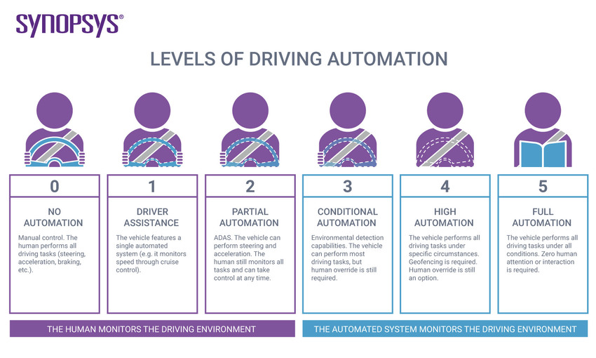
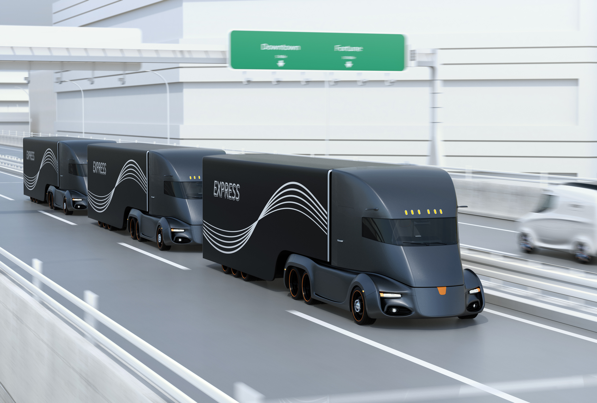
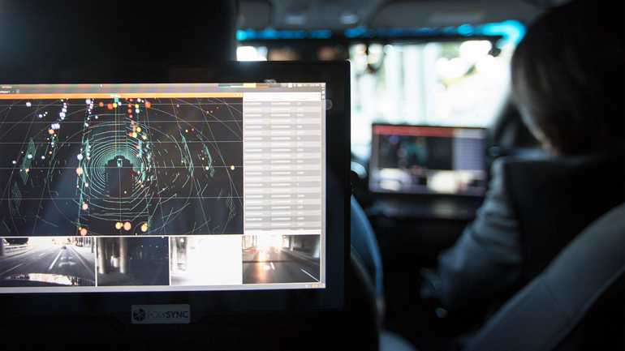
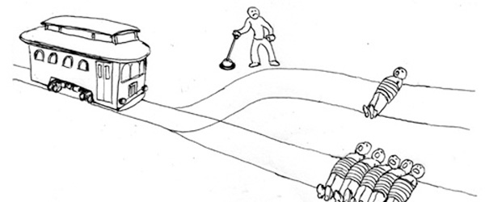
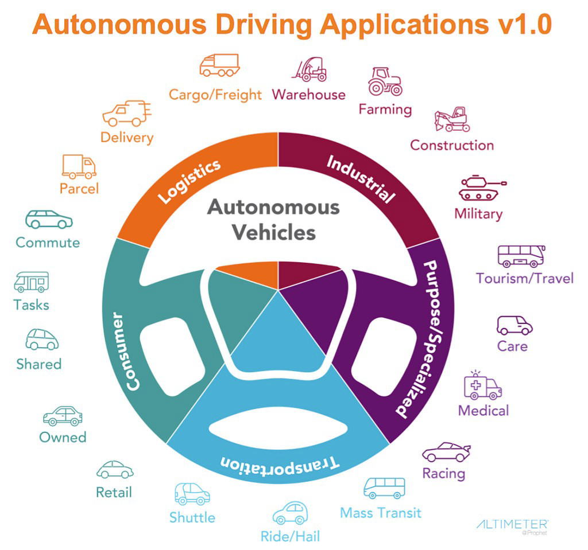

Otonom araç, çevresini algılayabilen ve insan müdahalesi olmadan çalışabilen bir araçlara deniyor. Bir sürücünün herhangi bir zamanda aracın kontrolünü ele geçirmesi veya bir insanın araçta bulunması gerekmez. Otonom bir araç, geleneksel bir otomobilin gittiği her yere gidebilir ve deneyimli bir insan sürücünün yaptığı her şeyi yapabilir.

The Society of Automotive Engineers (SAE) otonom sürüşü 0. Seviyeden (tamamen manuel) 5. Seviyeye (tamamen otomatik) olmak üzere toplam altı seviyeye ayırıyor.

## Otonom / Otomatik / Kendi Kendine Sürüş

SAE otonom yerine otomatik kelimesini tercih ediyor, daha çok kelimenin anlamının elektromekanik dışında da kullanımı olduğu için. Genel kabul edilen görüşe göre otonom araçlar "beni işe götür" dediğinizde kendi kararını verip sizi sahile götürebilirken :) otomatik araçlar verilen emirleri izleyerek sizin sözünüzün dışına çıkmadan kendi kendine gidebiliyor.

Kendi kendine sürüş ise otonom yerine de kullanılabilirken ufak bir fark da barındırıyor. Kendi kendine sürüş yapan araçlarda her zaman bir yolcu kontrolü ele geçirmeye hazır bulunması gerekiyor. Bu durumda seviye 3 ve 4 altına düşüyor diyebiliriz. Ancak tam otonom araçlar seviye 5 kabul ediliyor.

Terim tartışmasını uzatmadan bu yazıda otonom araçları SAE'nin otomatik araçları olarak kabul edeceğim.

## Kullanım Yaklaşımları

Hepimiz Tesla ve başardıkları hakkında fikir sahibiyiz. Ancak teknolojik gelişmelerin yaygınlaşması genelde büyük şirketlere para kazandırmalarıyla oluyor.

Biliyorsunuz satın aldığımız neredeyse her ürün kamyonlar ve tırlar ile hedeflerine ulaştırılıyor. Trafikte tır ve kamyonların çokluğundan şikayet edenlere sık sık "o zaman alışveriş yapma" lafı söylenir. Otonom sürüş yaklaşımını bir iş çözümü olarak kullanmaya en hevesli sektörün lojistik olduğunu söyleyebiliriz.

### Platooning (Müfrezeleme gibi çevirebiliriz)

Günümüzde Platooning terimi sık sık duyuluyor, öncelikle onu açıklayalım. Bu yaklaşımda, bağlantı teknolojisi ve otomatik sürüş destek sistemleri kullanılarak bir konvoydaki iki veya daha fazla kamyonun birbirine bağlanmasıdır. Bu araçlar, otoyollar gibi yolculuğun belirli kısımları için birbirlerine bağlandıklarında aralarındaki mesafeyi koruyarak otomatik olarak ilerleyebilirler.

Takımın başındaki kamyon lider olarak hareket eder ve bir sürücüsü vardır. Arkasındaki araçlar ise liderin hareketindeki değişikliklere uyum sağlarlar - sürücülerin çok az veya hiç müdahalesi gerekmez. 

Faydaları ise:

* **Temiz**. Daha az yakıt harcanarak tasarruf sağlanır. Otomatik sürüşün getirdiği sabit hız ve kontrollü yavaşlama dışında araçların birbirine yakın olmasının sağladığı az hava sürtünmesi de buna yardımcı olur.
* **Güvenli**. Tepki süreleri insanlarınkinden çok daha iyi olduğundan frenleme anında yapılabilir.
* **Etkin**. Kamyonların daha hızlı hareket etmesi hedefe hızlı ulaşmalarını; birlikte olmaları trafiğe daha seyrek karışmalarını sağlar.

### Otomatik Karayolu Taşıma Sistemleri (ARTS)

Karayollarında otomatik sürüş ile tasarlanabilecek çözümleri uzmanlar 4 kategoriye ayırmışlar.

* **Kişisel Hızlı Transit (PRT)**: 4 kişilik araçlar kullanan otomatik bireysel ulaşım sistemleri. PRT'ler, yolcuları doğrudan bir başlangıç ​​durağından bir varış durağına taşıyan, duraklı ağlarda çalışır.
* **CyberCar (CC)**: Taşıma sistemi, 4 ila 20 yolcu arasında değişen otomatik karayolu araçlarına dayanmaktadır. Duraklı ağlarda çalışırlar, ancak PRT'nin aksine, yolcular farklı çıkış ve varış noktalarına sahip olabilirler.
* **High Tech Bus (HTB)**: Taşıma sistemi, 50'den fazla yolcuya sahip otomatik karayolu otobüsüne dayanmaktadır. Rehberlik, sürücü yardımı veya tam otomasyon ve platoon için çeşitli otomatik sistemler kullanabilirler.
* **Çift Modlu Araçlar (DMV)**: sıfır veya çok düşük emisyonlu araçlar, sürücü destek sistemleri, park yardımı ve çarpışmadan kaçınma gibi araçlar. Ya bir sürücüye sahip olabilirler ya da tam otomatik ve sürücüsüz olabilirler.

## Nasıl Çalışıyorlar?

Otonom araçlar, sürüş kontrolünü yapan yazılımı yürütmek için sensörlere, karmaşık algoritmalara, makine öğrenim sistemlerine ve güçlü işlemcilere güveniyor.

Otonom araçlar, aracın farklı yerlerinde bulunan çeşitli sensörlere dayalı olarak sürekli çevrelerinin bir haritasını oluşturur. Radar sensörleri, yakındaki araçların konumunu izler, kameralar trafik ışıklarını algılar, yol işaretlerini okur, diğer araçları takip eder ve yayaları gözlemler. Lidar (ışık algılama ve menzil) sensörleri, mesafeleri ölçmek, yol kenarlarını tespit etmek ve şerit işaretlerini belirlemek için otomobilin çevresindeki ışık hüzmelerini sektirme yöntemini kullanır (inşaat işlerinde ustaların kullandığı ışınlı mezura gibi). Tekerleklerdeki ultrasonik sensörler, park ederken bordürleri ve diğer araçları algılar.

Son derece gelişmiş ve karmaşık yazılım daha sonra tüm bu veri girdilerini işler, bir yol çizer ve hızlanmayı, frenlemeyi ve direksiyonu kontrol eden aracın kontrol devrelerine talimatları gönderir. Sabit kodlanmış kurallar, engellerden kaçınma algoritmaları, tahmine dayalı modelleme ve nesne tanıma, yazılımın trafik kurallarını izlemesine ve engelleri aşmasına yardımcı olur.

Ancak her sensörün günün saati ve ortamın durumuna göre yaşayabildiği sıkıntılar olabiliyor. Akşam saatlerinde kameralardan düzgün görüntü alınamayabilirken, radar ile elden edilen veriler yeterince detay içermeyebiliyor. Lidar ikisinin kusurlarını örtüyor gibi görünse de yağmur, kar gibi hava şartlarından kötü etkilenebiliyor.

Otonom araçlar bu sorunları aşabilmek için, verileri güçlü yapay zeka sistemleriyle gerçek zamanlı olarak yorumlamada birden çok sensörden yararlanıyor. Sensörler, farklı tekniklerle aynı alanın görüntülerini üreterek, görüş alanları örtüşecek şekilde düzenliyor. Böylece iş sağlama alınıyor, örneğin, bir kameranın iyi çalışamayacağı kadar karanlık olsa bile yararlı radar verileri olabileceği anlamına gelir. Ayrıca, birden çok sensörden gelen görüntünün yanlış okumaları göz ardı etmek ve tek bir güvenilir ölçüme ulaşmak için karşılaştırılabileceği anlamına da geliyor.

## Otonom Araçlarda Yapay Zeka ve Makine Öğrenmesi

Yapay zeka, yüzlerce farklı sensörden üretilen gerçek kelime veri noktalarına hızlı bir şekilde değerlendirip yanıt verebilir, ancak sokaklara çıkması kesinlikle biraz zaman alacak gibi görünüyor.

Otonom araçlar son zamanlarda sık sık manşetlerde yer alıyor ve teknoloji seminerlerinin hakimi oluyor. Uber sonrası toplu işe gidip gelme ve mal taşımacılığı kesintisi olarak görülüyorlar. Şüphesiz, sürücüsüz araçlar yakın bir zamanda yapay zekanın da yardımıyla hayatımızın vazgeçilmez bir parçası olacak.

Waymo ve Tesla gibi şirketler, sürücüsüz arabalara büyük yatırım yapıyorlar. Şu anda Waymo, 2017'de bir ara verdikten sonra sürücüsüz otomobilleri test etmeye yeniden başladı. Şirket tamamen sürücüsüz bir çözüme doğru ilerlemek için yeterli veriyi elde edene kadar araçların içindeki sürücülerle testler yapılıyor.

Otomasyon düzeyine bağlı olarak, otonom tanımı değişir. Sürücü yardımı ve kısmen otomatikleştirilmiş otomobiller için otomasyon ticari kullanımdayken, kalan aşamalar hala test koşullarında.

Yasal ve sosyal kabullere tabi olarak, tamamen otonom araçların etkisi yalnızca toplu taşıma sistemine etkisiyle değil, aynı zamanda diğer endüstrileri temellerinden sarsma potansiyeliyle de sınırlı.

Otonom araçlardan bahsederken yapay zekadan bahsetmemek neredeyse imkansız. AI, arabaların trafikte gezinmesini ve karmaşık durumların üstesinden gelmesini sağlamak için kullanılıyor. Ayrıca, birleşik bir AI yazılımı ve kameralar gibi diğer IoT sensörleri ile doğru ve güvenli sürüş sağlamak daha kolay hale geliyor.

### Güvenlik

Yapay zeka, sürücü koltuğunu tamamen ele geçirmeden önce, kullanıcıların, yasa düzenleyicilerin ve üreticilerin güvenini kazanmak için yardımcı pilot olarak kullanılıyor. Yapay zeka, sensörleri üzerinden veri akışlarını analiz ederek, canlı sürücülerinin insan hataları yapmaya yatkın olduğu durumlarda kullanışlı oluyor. Bazılarını listelersek:

* Aracın acil durum kontrolü
* Çapraz trafik algılama
* Trafik sinyalleri ile senkronizasyon
* Acil durumlarda fren
* Kör noktaların aktif izlenmesi

### Bireyler için Hedeflenen Seçilmiş Bulut Hizmetleri

AI, aracın fiziksel durumunu doğru bir şekilde ölçmek için kullanılabilir. Kullanımdan toplanan veriler ise aşağıdakiler için yorumlanabilir:

* Bakım zamanı tahmini
* Düzenli bakım

Circle Auto Shield uzmanlarının deyimiyle, "Sürücüler, uygun maliyetli ve özel ihtiyaçlarını karşılayan ve aynı zamanda otomobilin mevcut durumunu yansıtan bir araç sigorta planı bulmakta daha rahat olacak".

### Yasa Düzenleyiciler ve Sigorta Şirketleri için Doğru Bilgi Sağlama

Otomatik arabalardan gelen veriler, trafik ihlallerini ve sigorta taleplerini netleştirmek için kullanılabilir. Sigorta perspektifinden bakıldığında, AI aşağıdakilerin belirlenmesine yardımcı olabilir:

* **Sürücü risk değerlendirmesi**. AI kullanılarak, bir sürücünün davranışı doğru bir şekilde ölçülebilir ve risk profiline bağlı olarak sigorta maliyeti buna göre ayarlanabilir.
* **Sigorta talep kolaylığı**. Araçtan alınan veriler, kaza durumunda hak taleplerinin daha hızlı işlenmesi için kullanılabilir. Örneğin Art Financial, kullanıcıların aracın hasar alanını taramak için bir akıllı telefon kamerası kullanarak otomatik hasarlarına erişmelerine olanak tanıyan yapay zeka tabanlı bir video uygulaması olan Dingsunbao 2.0'ı kullanıma açtı.

### Sürücü ve Kullanıcı Davranışını İzleme

Yapay zekanın otonom araçlarda uygulanabilirliği, güvenlik gibi daha katı gereksinimlerle sınırlı değil. AI, arabanın içinde bazı özelliklerin kontrolü ve eğlence için de kullanılabilir.

AI, seyahat sırasında özelleştirilmiş eğlence sağlamak için yararlı olabilir. Zaman içinde toplanan verilere dayanarak, kullanıcı davranışına göre tercihleri ​​tahmin edebilir ve belirlenebilir. Aşağıdakiler gibi:

* Koltuk konumu ayarı
* Ayna ayarı
* Klimanın düzenlenmesi
* Çalınacak müzikler

AI, insanların zahmetsiz geçiş deneyimi yaşamaları için otonom sürüşü geliştiriyor. Hükümetler de yapay zeka tabanlı sürücüsüz arabaları ticari kullanıma sokmak için yatırımcıları ikna ederek yarışa katıldılar.

Ağustos 2018'de, İngiliz Hükümeti, kendi kendine giden arabaları test etmek için uygun bir varış noktası olarak şirketleri çekmek amacıyla bir yapay zeka simülatörü planlarını açıkladı. OmniCAV olarak adlandırılan simülatör, 32 km'lik Oxfordshire yollarının sanal bir versiyonunu yeniden oluşturabiliyor.

Dünya değişiyor ve yapay zeka her geçen gün daha akıllı hale geliyor. Ancak, Uber sonrası döneme tanıklık etmek için köşeyi dönmüş olsak da, nefesini tutmayın: Tamamen otonom sürüşün daha yapılacak uzun bir yolu var.

## Tramvay Problemi

Elon Musk, şirketi Tesla'nın 2020'nin sonuna kadar tamamen otonom arabalara sahip olacağını düşünüyor. Son zamanlarda "Geriye kalan temel zorluklar yok" diyor ve ekliyor, “Çok sayıda küçük sorun var. Ve sonra tüm bu küçük sorunları çözme ve tüm sistemi bir araya getirme zorluğu var. "

Bir aracın insan müdahalesi olmadan bir yolculuğu tamamlamasını sağlayan teknoloji (5. seviye otonomi) hızla ilerliyor olsa da, bunu güvenli ve yasal olarak yapabilen bir araç şimdilik esas sıkıntı.

İlk olarak 20. yüzyılın başlarında ortaya atılan Tramvay Problemi, etik ve ahlaki felsefede en çok tanınan sorulardan biridir. Sorun, insansız bir tramvayın bağlı beş kişiye doğru raylar üzerinde kontrolsüz bir şekilde ilerlediğini gören bir tanığın ne yapması gerektiğini sorar. Rayların kenarında tramvayı alternatif yola yönlendirmek için kullanılabilecek bir kaldıraç vardır, ancak tanık bunu yaparsa diğer yola bağlanmış bir kişiye çarpacaktır. Tanık pasif olarak beş kişinin ölmesini mi yoksa aktif olarak müdahale etmeyi mi tercih edeceğini ve beş kişiyi kurtarmak için bir kişinin ölümüne neden olup olmayacağını seçmek zorundadır.

Benzer etik ikilemler için ilginç düşünce deneyleri olabilirse de, Trolley Probleminin günümüzdeki gerçeğe en yakın örneği sürücüsüz araçlardır. Bazıları bunu konuya kötü bir yaklaşım olarak görse de, doğru senaryo uyarlaması ile hala çıkarılacak dersler var.

Gerçek hayattaki bir tramvay probleminde tanıktan istenen ani kararın aksine, otonom aracı tasarlayan geliştiriciler, programcılar, etikçiler ve mühendislerden oluşan ekip, arabadan çok önce her potansiyel durumda hangi hesaplamaların en uygun olduğuna karar verme lüksüne sahiptir. Bu şekilde, programlama ekibi, aracın algoritmalarını kodlayarak "kolu ne zaman çekeceklerini" etkin bir şekilde önceden belirledikleri için tramvay problemindeki tanık onlar kabul edilebilir.

Olasılıksal olarak gözden kaçmış veya kazanım değeri sonuçları (reinforcement) olarak kodlanmış olsun, temel soru aynıdır: ani benzer bir durumla karşılaşıldığında araç kimi kurtarmalı?

Orijinal tramvay probleminin yalnızca iki farklı sonucu varken, otonom araçlar neredeyse sonsuz sayıda sonuç ortaya çıkarabilir. Ray yok, kimse bağlı değil, yolda binlerce başka "tramvay" var ve potansiyel kurbanlar arasında arabanın yolcuları da var. Neyse ki, bu artan sonuç yelpazesi, kimsenin ölmediği pek çok seçeneği içeriyor. Bu durumlarda tasarım ekibi, ölümcül olmayan sonuçların en iyi şekilde nasıl tartılacağını düşünmelidir.

Bu senaryoda kabul edilen en ideal çözüm, otonom aracın yolda bir çocuğa çarpması yerine gerekirse kendini yok edecek şekilde tasarlamak, çocuğu ve eksiksiz bir şekilde uygulanmış araç güvenlik özellikleri ile yolcuları kurtaran, ancak aracı perte çıkarmaktır. 

Diğer fedakarlıklar yararlı olabilir; bir hız sınırlayıcı potansiyel ölümleri ve hasarı kısıtlayabilir, ancak performansı ve daha yüksek hızın kazanımını azaltabilir. Belki de hayvanlar, insanlara kıyasla her zaman düşük değerli olarak algılanabilir; bu, yoldan çıkmanın neden olduğu kazaları önlemek için yoldaki köpeklere rutin olarak vurulacağı anlamına gelir. Yakın zamanda izlediğim "Don't F**k With Cats" belgeselinde tekrar dikkatimi çeken, insanların çoğunlukla bir insanın ölümünden çok bir evcil hayvanın ölümüne üzülmesini, ve benim de benzer bir şekilde tepki verdiğimi farkettiğimden umarım hayvanlar da insanlar kadar korunu diyorum.

## Kullanım Alanları

Otonom araçların gelişimi hızlanıyor. Tüketicileri ve şirketleri nasıl etkileyebilecekleri ve bazı kullanım alanlarını listeleyelim. Doğuş Teknoloji olarak bu çözümlerin her birisine yazılım geliştirme, sensör programlama, yapay zeka ve makine öğrenmesi gibi çözümler üretebiliriz.

### Birinci Faz

#### Endüstriyel filolar

Herhangi bir karayolu taşıtının kısa vadede (örneğin, 2020-22'ye kadar) "tamamen otonom" sürüş teknolojisine sahip olması pek olası olmasa da, madencilik ve çiftçilik gibi kontrollü ortamlara sahip seçilmiş uygulamalarda kullanımı kaçınılmazdır. Bu durumlarda, operasyonların kısıtlı doğası ve özel yollarda çalışma imkanı, uygulamayı kolaylaştırır. Bu alanlardaki işgücü maliyeti tasarrufu ve optimize edilmiş sürüş yoluyla karbondioksit (CO2) emisyonlarında azalma (emisyonları yüzde 60'a kadar düşürdüğü gösterilmiştir) sağlanmıştır. Diğer benzer ekipman ağırlıklı iş kollarında - örneğin inşaat ve depolama sektörlerinde - ekskavatörler, forkliftler ve yükleyiciler gibi araçlar için AV uygulamaları büyük ihtimal dahilindedir.

Orta vadede (2040'a kadar), karayolu kamyonları büyük olasılıkla kamuya açık yollarda tam teknolojiye sahip ilk araçlar olacak. Prototipler zaten mevcut ve şirketler şu anda karmaşık sürüş durumlarının üstesinden gelmek için gereken yazılım algoritmalarını geliştiriyor. Uzun vadeli otomatik ticari filolar, paket teslimatı için araçların yanı sıra birden fazla oyuncunun halihazırda saha testi yaptığı otomatik dronları içerebilir.

#### Otomobil Üretim Sektörü

Dünya çapındaki otomobil üreticileri, önümüzdeki iki ila üç yıl içinde otonom araçlar üzerindeki stratejik duruşlarını muhtemelen netleştirecekler. Otonom araç tekliflerini sunarken üstlenebilecekleri dört stratejik duruştan bahsediliyor:

* **Başı Çekenler**. Geniş müşteri tabanları ve güçlü teknik ve ticari yetenekleri olan köklü lider oyuncular, otonom araçlara muhtemelen aşamalı bir yaklaşım benimseyecektir. Bu da büyük olasılıkla, araçlarında kademeli olarak artan gelişmiş sürücü destek sistemleri (ADAS) tanıtacakları anlamına geliyor.
* **Saldırganlar**. Sektöre sonradan dahil olan ve "tamamen yeni" araç mimarileri geliştiren yeni sektör oyuncuları, hacimleri hızlı bir şekilde yakalamak ve yardımcı iş modellerini sürdürmek için "erişilebilir mobilite" ile tüketici segmentine odaklanacak.
* **Hızlı takipçiler**. Bu üreticilerin önemli teknik ve ticari kökleri vardır. Büyük olasılıkla otonom araç araştırmalarına yatırım yapacaklar ve daha sonra üst segmentlerdeki penetrasyonlarını artırırken temel teknolojilerin araç seviyesi maliyetlerinin düşmesini bekleyecekler.

#### Yeni Mobilite

Üreticiler otonom araçlar geliştirirken, diğer çeşitli ulaşım-mobilite yenilikleri şimdiden yola çıktı. Bunların çoğu, araç paylaşımı, "e-taksi" taksi alternatifleri ve eşler arası araç kiralama gibi kullanım başına ödeme modelleri şeklini alıyor. Bu girişimler yatırımları çekiyor ve etkileyici büyüme oranları yakalıyorlar. Özellikle e-taksi modeli, hem yıllık yatırım finansmanı hem de pazar penetrasyonu göz önüne alındığında güçlü bir büyüme yaşadı.

### İkinci Faz

#### Araba servisi manzarası değişiyor

Otonom araçların çoğalması, otomobil üreticileri için bir fırsat oluşturabilir. Örneğin, 2014 itibariyle, Almanya'daki araba servisi mağazalarının yaklaşık yüzde 80'i üreticilerden "bağımsız" idi. Otonom araç (AV) teknolojilerinin güvenlik açısından kritik doğası göz önüne alındığında, müşteriler AV sistemlerinin bakımı ve onarımı söz konusu olduğunda üretici (OEM) hizmet süreçlerine sıkı sıkıya bağlı kalmayı ve orijinal hizmet ekipmanının kullanılmasını tercih edebilir. Bu, AV bakım sistemlerini karşılayamayan bağımsız hizmet sağlayıcıları için dezavantajlı bir konuma işaret edebilir. Ayrıca yapılan bir araştırma, müşterilerin yaklaşık yüzde 60'ının akıllı arabalarının servis yerleri için verdiği tavsiyeleri takip edeceğini gösteriyor. Daha büyük bir satış sonrası gelir akışının faydalarının ötesinde, OEM'ler bu araçlara hizmet vermek için güçlü bir teşvike sahip olacak, çünkü hükümetler nihayetinde üreticileri AV teknik arızalarının neden olduğu çarpışmalardan kaynaklanan en büyük sorumluluk ve riski üstlenmeye zorlayabilirler.

#### Şirketler tedarik zincirlerini yeniden şekillendirebilir

Piyasadaki rakipler verimliliği ve esnekliği artırmak için otomasyon kullandığından, AV teknolojileri geleceğin sektör tedarik zincirlerini ve lojistik operasyonlarını optimize etmeye yardımcı olabilir. Akıllı teknolojilerle birlikte AV'ler, ekipman ve tesis üretkenliğini artırırken işçilik maliyetlerini azaltabilir. Dahası, tam otomatik ve yalın bir tedarik zinciri, akıllı dağıtım teknolojilerinden ve daha küçük AV'lerden yararlanarak yük boyutlarını ve stokları azaltmaya yardımcı olabilir.

### Üçüncü Faz

#### Sürücülerin her şey için daha fazla zamanı olacak

AV'ler, araç kullnarak geçen zamanı günde tahmini 50 dakika kadar kısaltarak bu sürenin çalışarak, dinlenerek veya eğlence ile geçirebilmesini sağlayabilir. İşe gidip gelenler tarafından her gün kazanılan zaman, küresel olarak akıllara durgunluk veren bir milyar saate, yani Büyük Giza Piramidi'ni inşa etmek için harcanan sürenin iki katına eşit olabilir. Ayrıca, insanların bir arabadayken mobil İnternette harcadıkları her ek dakika için yılda 5 milyar Euro'luk küresel dijital medya geliri yaratma potansiyeli olan büyük bir değer havuzu yaratabilir.

#### Park etmek kolaylaşıyor

AV'ler, tüketicilerin hareketlilik davranışını değiştirebileceği ve potansiyel olarak Amerika Birleşik Devletleri'ndeki park yeri ihtiyacını 5,7 milyar metrekareden fazla azaltabileceği öngörülüyor. Park altyapısındaki azalmaya birden çok faktör katkıda bulunacaktır. Örneğin, kendi kendine park eden AV'ler, park halindeyken yolcuları bırakmak için açık kapı alanı gerektirmez, bu da yüzde 15 daha dar park yerlerini işgal etmelerine olanak tanır.

#### AV'ler, tüketici uygulamaları için robotik geliştirmeyi hızlandırır

AV'lerin geniş çapta yayılması, tüketici uygulamaları için (insansı robotlar dahil) robotiklerin gelişimini muhtemelen hızlandıracaktır, çünkü ikisi birçok teknolojiyi paylaşmaktalar. Bunlara, uzaktan gelişmiş algılama, aşırı hassas konumlandırma / GPS, görüntü tanıma ve gelişmiş yapay zeka sayılabilir. Paylaşılan teknolojilere ek olarak, AV'ler ve robotlar, şarj istasyonları, servis merkezleri ve makineden makineye iletişim ağları dahil olmak üzere aynı altyapıyı kullanmaktan yararlanabilir.

---

Otomotiv endüstrisini dönüştürmenin yanı sıra, otonom araçların yükselişinin toplum üzerinde derin bir etkisi olması muhtemel. Bu ortamın nasıl etkili bir şekilde şekillendirileceğinin tanımlanması, önümüzdeki yıllarda endüstri ve hükümetler için önemli bir stratejik zorluk teşkil etmektedir.

## Referanslar

* [https://www.synopsys.com/automotive/what-is-autonomous-car.html](https://www.synopsys.com/automotive/what-is-autonomous-car.html)
* [https://www.viatech.com/en/2019/10/why-sensor-fusion-is-the-key-to-self-driving-cars/](https://www.viatech.com/en/2019/10/why-sensor-fusion-is-the-key-to-self-driving-cars/)
* [https://www.acea.be/uploads/publications/Platooning_roadmap.pdf](https://www.acea.be/uploads/publications/Platooning_roadmap.pdf)
* [https://www.forbes.com/sites/richardbishop1/2020/05/02/us-states-are-allowing-automated-follower-truck-platooning-while-the-swedes-may-lead-in-europe/#152bc60fd7e8](https://www.forbes.com/sites/richardbishop1/2020/05/02/us-states-are-allowing-automated-follower-truck-platooning-while-the-swedes-may-lead-in-europe/#152bc60fd7e8)
* [https://www.vtpi.org/avip.pdf](https://www.vtpi.org/avip.pdf)
* [https://www.machinedesign.com/mechanical-motion-systems/article/21838234/how-ai-is-paving-the-way-for-autonomous-cars](https://www.machinedesign.com/mechanical-motion-systems/article/21838234/how-ai-is-paving-the-way-for-autonomous-cars)
* [https://fee.org/articles/the-trolley-problem-and-self-driving-cars/#:~:text=The%20Car%20as%20the%20Trolley,driverless%20car%20becomes%20the%20trolley.](https://fee.org/articles/the-trolley-problem-and-self-driving-cars/#:~:text=The%20Car%20as%20the%20Trolley,driverless%20car%20becomes%20the%20trolley.)
* [https://www.mckinsey.com/industries/automotive-and-assembly/our-insights/ten-ways-autonomous-driving-could-redefine-the-automotive-world](https://www.mckinsey.com/industries/automotive-and-assembly/our-insights/ten-ways-autonomous-driving-could-redefine-the-automotive-world)