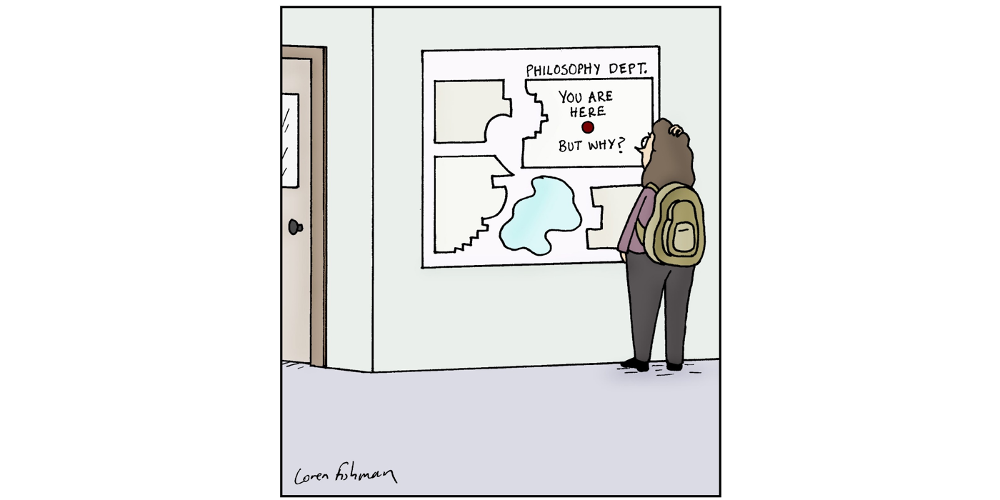
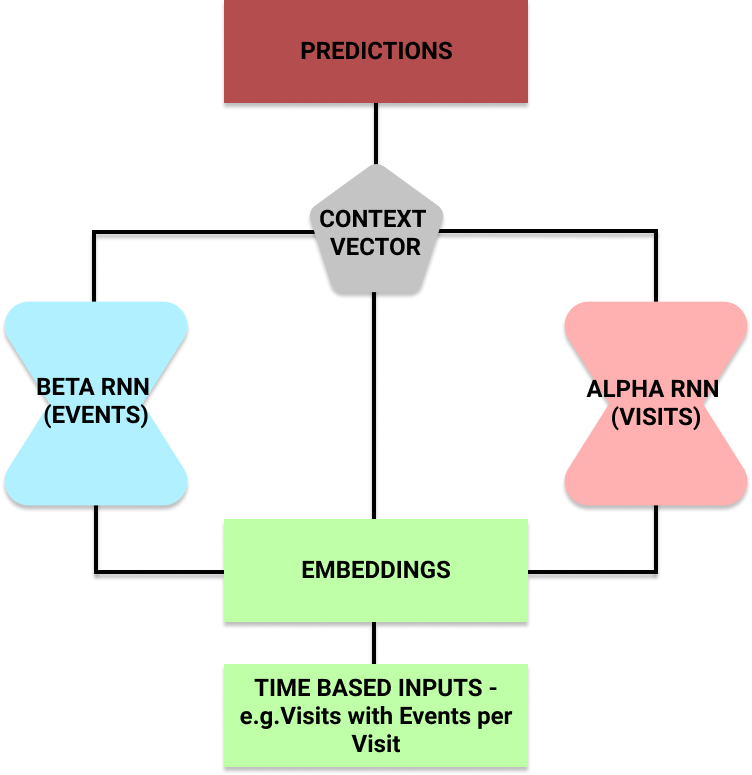
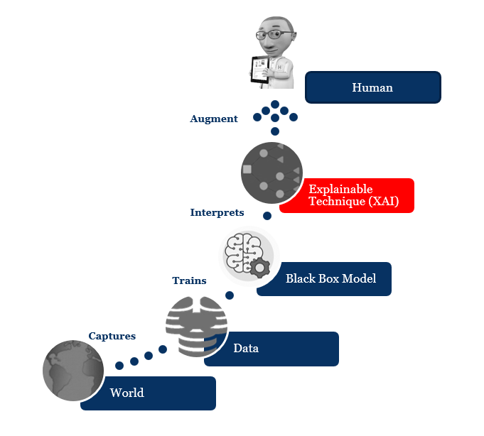

Açıklanabilir AI (XAI), yapay zeka kullanılarak ulaşılmış bir çözümün sonuçlarının insanlar tarafından anlaşılabileceği şekilde ortaya koyabilmek için izlenen yöntem ve tekniklere deniyor. Yapay zekanın davranışlarının arkasında yatan nedenleri anlayamamanın çok korkutucu olduğunda hepimiz hemfikiriz, Hollywood bize bunu yıllardır anlatmaya çalışıyor. Sistemi tasarlayanların bile yapay zekanın neden belirli bir karara vardığını açıklayamadığı makine öğrenimindeki "kara kutu" kavramının tam tersi gibi aslında. XAI, sosyal [açıklama hakkının](https://en.wikipedia.org/wiki/Right_to_explanation) bir uygulaması olarak görülebilir. Bir iş, okul ya da kredi başvurusu yaptığınızda sizi otomatik olarak eleyen sistemin nasıl bu sonuca vardığını öğrenmek isteyebilirsiniz. Günümüzde, özellikle Amerika Birleşik Devletleri ve Avrupa'da bir çok ülkede halen eğitim gibi herkesin eşit koşullarda değerlendirilmesini bekleyeceğimiz alanlarda ırk, cinsiyet ve sosyal statü gibi değerlerin seçim kriteri olduğunun haberlerini sık sık görüyoruz. Yakın gelecekte, bir kazadan sonra robotların hayat kurtarırken bu tür kriterlere bakmayacağından da emin olmamız lazım.

https://philosophynow.org/issues/135/Loren_Fishmans_Cartoon

Ayrıca XAI, yasal yaptırımlar veya zorunlu denetlemeler olmasa bile anlamlıdır - örneğin, XAI, son kullanıcıların AI'nın iyi kararlar verdiğine güvenmesine yardımcı olarak bir ürün veya hizmetin kullanıcı deneyimini iyileştirebilir.

Yapay zeka kararlarını açıklamanın teknik zorluğu bazen yorumlanabilirlik sorunu olarak anılır. Dikkate alınması gereken bir diğer husus da, internet ve özellikle sosyal medya ortamlarının toplumlara verdiği en büyük zararlardan olan bilgi fazlalığı [(infobesity)](https://en.wikipedia.org/wiki/Information_overload) olur, bu nedenle tam şeffaflık her zaman mümkün olmayabilir veya hatta gerekli olmayabilir. Yine de, kullanıcıları yanlış yönlendirerek güvenlerini kazanacak şekilde sistemi basitleştirmek ya da istenmeyen özellikleri saklamak yerine bir orta yol bulunmalı ve açıklanabilirlik ile başarım arasında denge kurulması gerekebilir.

## Çalışmalar

Oluşturduğumuz sistemlerin öğrendikleri özellikleri ve nasıl uygulandıklarını açıklayabilmesini mi istiyoruz? Sistemin bir tahminin neden makul olduğunu gerekçelendirmesini istiyor muyuz? İkisini de mi istiyoruz? Bu hedeflere ulaşmak için nasıl çalışabiliriz?

Genel olarak 3 kategoriye giren tekniklerle bu soruları yanıtlamak için epeyce araştırma yapılmaktadır:

* ***Derin Açıklama*** - İç gözlem veya gerekçelendirme yoluyla bir yapay sinir ağının ne yaptığını anlamaya çalışmak
* ***Model İndüksiyonu*** - Eğitilmiş bir sistemin ortaya çıkan davranışına bakmak ve bunu davranışı açıklamak için kullanılabilecek modeli geliştirmek için kullanmak
* ***Makine Öğretimi ve Yeniden Oluşturulabilirlik*** - Büyük veri sistemlerinde bulunan kavramsal hiyerarşileri oluşturabilmek için makine öğrenimini ve konu uzmanlığını birleştirmek

1970'lerden 1990'lara kadar, MYCIN, GUIDON, SOPHIE, ve PROTOS gibi karar sistemleri, teşhis için akıl yürütmelerini gerekçelendirebilecek ve bunları tanı için komutlar ve makine öğrenmesi düzeyinde açıklayabilecek şekilde araştırıldı. 1970'lerin başında kan dolaşımındaki bakteri enfeksiyonlarını teşhis etmek için bir araştırma prototipi olarak geliştirilen MYCIN, belirli bir vakada el ile kodlanmış kurallardan hangisinin tanıya katkıda bulunduğunu geri bildirebilir. Akıllı eğitim sistemlerinde yapılan araştırmalarda (SOPHIE gibi), öğrencinin anlayabileceği bir düzeyde problem çözme stratejisini açıklayan ve bir sonraki adımda hangi eylemi yapacaklarını bilecek bir 'ifade uzmanı' olarak hareket edebilen sistemler geliştirildi. Örneğin, SOPHIE, sonuçta SPICE devre simülatörüne güvenmesine rağmen, elektronik sorun giderme işleminin ardındaki nitel mantığı açıklayabilir. Benzer şekilde, GUIDON, MYCIN'in etki alanı düzeyindeki kurallarını desteklemek için öğretici kurallar ekleyerek tıbbi teşhis stratejisini açıklayabiliyor. Makine öğrenimine yönelik sembolik yaklaşımlar, özellikle PROTOS gibi açıklamaya dayalı öğrenmeye dayananlar, hem eylemlerinin sebebini ortaya koyabilmek hem de yeni bilgi edinmek için açıklamalara bel bağlıyorlardı.

1980'lerden 1990'ların başlarına kadar, nedensel muhakeme, kurala dayalı ve mantık temelli çıkarım sistemlerinin yeteneklerini genişletmek için doğruluk koruma sistemleri (TMS) geliştirildi. TMS, alternatif çıkarım yollarını, sonuçların gerekçelerini ve çelişkilere yol açan karar yollarını açık bir şekilde izlemeye çalışır.

1990'larda araştırmacılar, kapalı eğitilmiş sinir ağları tarafından üretilen, elle kodlanmamış kuralları anlamlı bir şekilde çıkarmanın mümkün olup olmadığını araştırmaya başladılar. Uzman sistem araştırmacıları, bu teknolojilerin uygulamada daha güvenilir ve güvenilir olmasını sağlayan dinamik açıklamalar geliştirmeye çalıştılar. 2010'larda, yapay zekanın cezai hüküm verme kararları için kullanımında ırksal ve diğer önyargılarla ilgili kamuoyunun endişeleri ve kredibilite bulguları, şeffaf yapay zeka talebinin artmasına yol açmış olabilir (haliyle).

Sonuç olarak, birçok akademisyen ve kuruluş, sistemlerindeki önyargıyı tespit etmeye yardımcı olacak araçlar geliştiriyor.

Marvin Minsky ve başkaları yapay zekanın, bir gözetleyici olarak, gözetleme ve takibin tanımı ve doğasında yer alan önyargıları da hesaba kattığımızda karşımıza çıkan ürkütücü sonuçlara karşı, daha adil ve dengeli bir "döngü içinde insan" yapay zekası oluşturmanın bir yolu olarak HI (Hümanist Zeka)'yı önerdi

Derin öğrenme ve genetik algoritmalar gibi modern karmaşık AI teknikleri doğal olarak bilinmezle doludur. Bu sorunu çözmek için, yeni modelleri daha açıklanabilir ve yorumlanabilir hale getirme adına birçok yeni yöntem geliştirilmiştir ve araştırmalara devam edilmektedir.

Günümüzde yaygın destek görmüş bazı çalışmalar ise aşağıdaki gibi:

### Reversed Time Attention Model (RETAIN)

RETAIN modeli Georgia Institute of Technology üniversitesinde Edward Choi ve arkadaşları tarafından geliştirilmiştir. Doktorların, bir modelin neden hastaların kalp yetmezliği riski altında olduğunu tahmin ettiğini anlamalarına yardımcı olmayı hedefleyen sistemin yaklaşımı aşağıdaki gibi.

RETAIN Tekrarlayan Sinir Ağı Modeli, yorumlanabilirliği geliştirmek için [Dikkat Mekanizmalarından](http://www.wildml.com/2016/01/attention-and-memory-in-deep-learning-and-nlp/) yararlanır

Buradaki fikir, bir hastanın ziyaretlerini de içeren hastane ziyaret kayıtları göz önüne alındığında, kalp yetmezliği riskini tahmin edebilmesidir. Araştırmacılar veriyi tekrarlayan iki sinir ağına göndermişler. Bu, sinir ağının neye odaklandığını anlamak için her birindeki dikkat mekanizmasını kullanmalarına sağlamış. Model eğitildikten sonra hastanın riskini tahmin edebilir duruma gelmişler. Ayrıca, hangi hastane ziyaretlerinin (ve bir ziyaret içindeki hangi olayların) seçimini etkilediğini çıktı olarak almak için alfa ve beta parametrelerini de kullanabiliyorlar.

### Yerel Yorumlanabilir Model-Bağımsız Açıklamalar (LIME)

Kullanımda oldukça yaygın hale gelen bir başka yaklaşım LIME'dır.

Bu post-hoc bir modeldir - karar verildikten sonra bize bir açıklama sunar. Bu, tam bir "şeffaf kutu", yani transparan bir model (karar ağaçları gibi) olmadığı anlamına gelir.

Bu yaklaşımın en güçlü yönlerinden biri, modelden bağımsız olmasıdır. Öngörülerine açıklama getirmek için herhangi bir modele uygulanabilir. Bu yaklaşımın altında yatan temel kavram, girdileri bozmak ve bunun modelin çıktılarını nasıl etkilediğini izlemektir. Bu, modelin hangi girdilere odaklandığı ve tahminlerini yapmak için kullandığına dair bir çerçeve oluşturmamızı sağlar. Örneğin, görüntü sınıflandırması için bir tür [CNN](https://en.wikipedia.org/wiki/Convolutional_neural_network) düşünelim. Bir açıklama üretmek için LIME modelini kullanmanın dört ana adımı vardır:

* Normal bir görüntü ile başlayın ve sınıflar üzerinde bir olasılık dağılımı oluşturmak için kara kutu modelini kullanın.
* Ardından girişi bir şekilde karıştırın. Görüntüler için pikselleri griye boyayarak gizlemek olabilir. Şimdi bunları, başlangıçta tahmin ettiği sınıfın olasılıklarının nasıl değiştiğini görmek için kara kutu modelinde tekrar çalıştırın.
* Değişiklikleri açıklayan temel özellikleri çıkarmak için bu karışıklıklar ve olasılıklar veri kümesinde karar ağacı gibi yorumlanabilir (genellikle doğrusal) bir model kullanın. Model yerel olarak ağırlıklandırılmıştır - yani, kullandığımız orijinal görüntüye en çok benzeyen karışıklıkları daha çok önemsiyoruz.
* Açıklamamız olarak özellikleri (bizim durumumuzda, pikseller) en büyük ağırlıklarla yazdırın.

### Katman Bazında Alaka Yayılımı (LRP)

Bu yaklaşım, alaka düzeyinin yeniden dağıtılması ve korunması fikrini kullanır.

Bir girdi (örneğin bir görüntü) ve onun bir sınıflandırma olasılığı ile başlıyoruz. Ardından, bunu tüm girişlere (bu durumda pikseller) yeniden dağıtmak için geriye doğru çalışıyoruz. Yeniden dağıtım süreci, katmandan katmana oldukça basittir.

Korkmayın demişler ancak benim gibi çok da işin içinde değilseniz korkutucu geliyor tabii. Ancak biraz inceleyince bu denklemin sadece nöron aktivasyonuna ve ağırlık bağlantısına göre alaka düzeylerini oranladığı görülebiliyor.

Yukarıdaki denklemde, terimlerin temsil ettiği değerler aşağıdaki gibi:

* x_j - katman ***l***'deki neuron ***j*** için aktivasyon değeri
* w_j, k - katman ***l***'deki nöron ***j*** ile katman ***l + 1***'deki nöron ***k*** arasındaki bağlantının ağırlığı
* R_j - Layer ***l***'deki her nöron için alaka düzeyi puanları
* R_k - Katman ***l + 1***'deki her nöron için alaka düzeyi puanları

## Yönetmelik ve Yaptırımlar

Yasa düzenleyiciler, resmi kurumlar ve genel kullanıcılar AI tabanlı dinamik sistemlere bağımlı hale geldikçe, güven ve şeffaflığı sağlamak için karar verme süreçlerinde daha net hesap verebilirlik gerekecektir. Bu gereksinimin daha fazla ivme kazandığının kanıtı, bu yeni disipline özel olarak adanmış ilk küresel konferans, Yapay Zeka üzerine Uluslararası Ortak Konferansı: Açıklanabilir Yapay Zeka Çalıştayı (XAI) düzenlenmiştir.

Avrupa Birliği, algoritmaların artan öneminden kaynaklanan potansiyel sorunları ele alma adına Genel Veri Koruma Hakkı (GDPR)'ya bir **açıklama hakkı** maddesi ekledi (yönetmeliğin uygulanmasına 2018 yılında başlanmış). Ancak, GDPR'de **açıklama hakkı**, yorumlanabilirliğin yalnızca yerel boyutunu kapsamaktadır. Örneğin, Amerika Birleşik Devletleri'nde, sigorta şirketlerinin oranlarını ve kapsam kararlarını açıklayabilmeleri bekleniyor.

## Endüstride Kullanım

Yapay zeka olgunlaştıkça ve kullanımı yaygınlaştıkça, insan ile karar ve sorumluluk almaya giderek daha az dayanan yeni uygulamaların büyümesini görme olasılığımız artıyor. Müzik öneri motorlarının yüksek bir sorumluluk yükü olmayabilir, ancak daha kritik sektörlerde diğer birçok gerçek veya potansiyel kullanım durumu bulunmakta.

### Sağlık

Açıklanabilir yapay zekayı kullanan bir makine, tıbbi personele önemli ölçüde zaman kazandırabilir ve tekrarlayan bir görev yerine tıbbın yorumlayıcı çalışmasına odaklanmalarına izin verebilir. Daha fazla hasta görülebilir ve aynı zamanda her hastaya daha fazla ilgi gösterilebilir. Potansiyel değer harika ancak açıklanabilir yapay zekanın sunduğu izlenebilir açıklamayı kesinlikle bir gereksinim. Açıklanabilir AI, bir makinenin verileri değerlendirmesine ve bir sonuca varmasına izin vermekle kalmaz, aynı zamanda bir doktor veya hemşireye, bu sonuca nasıl ulaşıldığını anlamak için karar ağacı verilerini vermelidir.

### Üretim

Yapay zeka ile doğal dil işleme ile, teknisyenlere düzensiz veriler içeren kullanıcı dokümaları içinde  rehberlik önerisi verilebilir; bakım standartları gibi verilerin yanı sıra geçmiş iş emirleri, IoT sensör okumaları ve iş süreci verileri gibi yapılandırılmış verileri analiz etmeye yardımcı olabilir.

Bu durumda, kullanıcıya yapay zekadan elde edilen çok sayıda potansiyel onarım kılavuzu önerisi seçeneğini ve olası her yanıtın yüzde güven aralığı gösterilebiliyor. Kullanıcıya her biri için olumlu oy verme ve olumsuz oylama seçenekleri sunuluyor, bu da sürekli öğrenme sürecine yardımcı oluyor ve gelecekteki önerileri iyileştiriyor. Bu şekilde, kullanıcıya tek bir yanıt verilmiyor, seçimler arasında gezerek kararı vermesine izin veriliyor. Her öneri için, gelişmiş bir özellik olarak, kullanıcının sonucun neden önceliklendirildiğine ve buna göre puanlandığına ilişkin parametreleri anlamasına yardımcı olmak için AI eğitim aşamasında kullanılan girdiyle birlikte bilgi grafiği çıktısı da kullanıcıya gösterilebiliyor.

### Sigorta

Sigortacılıkta yapay zeka için müşteri edinme, temsilci üretkenliği, talep önleme, sigortalama, müşteri hizmetleri, çapraz satış, poliçe düzenleme ve risk ile uyumluluğun iyileştirilmesi gibi bir çok potansiyel kullanım durumu bulunuyor. Çoğu sigorta yöneticisinin yapay zekanın önümüzdeki üç yıl içinde endüstrisinde devrim yaratmasını beklediğini gösteren yakın tarihli bir [Accenture anketi](https://www.accenture.com/t20181012T053502Z__w__/us-en/_acnmedia/PDF-76/Accenture-Insurance-Artifical-Intelligence-PoV.pdf) de bu görüşleri destekliyor.

Ancak, yaşam, ev sahibi, sağlık, işçi tazminatı vb. çok önemli konular ile çalışmak normal olarak riskli. Açıklanabilir yapay zeka bu noktada çok önem kazanıyor.

* Yapay zeka bu içgörüye veya sonuca nasıl ulaştığını açıklayabilir mi?
* Bu sonucu elde etmek için hangi veriler, modeller ve işlemler uygulandı?
* Düzenleyicilerim bu yapay zekanın nasıl çalıştığını anlayabilir mi?
* Kim neye ne zaman erişti?

## Bizim için ne demek?

Diyelim ki bütün gün metal müzik dinleyen birisine Spotify Justin Bieber şarkısı öneriyor, insan merak eder nerede hata yaptım, nereden çıktı şimdi bu? Tabii bu durum Spotify mühendislerinin algoritmalarının benim için şeffaf ve anlaşılır olmasını sağlamaları gerektiği anlamına gelmez, öneriyi biraz hedef dışı bulabilirim, ancak hayatımıza etkisi çok az düzeyde.

Bu, açıklanabilir AI için temel bir turnusol testidir - yani, makine öğrenimi algoritmaları ve insanların kolayca anlayabileceği ve kökenlerine kadar geriye doğru izleyebileceği sonuçlar üreten diğer yapay zeka sistemleri. Yapay zeka tabanlı sonuçların potansiyel sonuçları ne kadar büyükse, açıklanabilir yapay zekaya olan ihtiyaç da o kadar artar. Tersine, nispeten düşük riskli yapay zeka sistemleri, sonuçları anlamadığımız kara kutu modelinde gayet sorunsuz devam edebilir.

Biz yine de biraz düşünelim, her zaman hazır olmakta fayda vardır.

### Bankacılık

Günümüzde yapay zeka bankacılık sektöründe, insanların finansal risk faktörlerini, harcama alışkanlıkları ve potansiyellerini tahmin etmek için kullanılıyor. Normalde gitmediğiniz bir semtte yapılan bir harcamadan sonra sizi bankanın arayıp riskli bir hareket tespit edebildik diyebilmesini de makine öğrenmesi sağlıyor.

Peki bu kararları nasıl verdi? İnsan ilk kez gittiği bir kasabada harcama yapınca ya da yeni bir siteden alışveriş yaptığında bankanın kartını kullanıma kapattığını görünce bir açıklama bekliyor.

### Otomotiv

Otomotiv sektöründe tahminler çok önemli. Yılın hangi dönemlerinde hangi modeller daha çok satılıyor? Hangi modellerde ve özellikle hangi parçalar için servis gerekiyor? Gelecek yoğun siparişlere yurtdışından teslimi bekliyoruz, ya da bu parça değişimi için iki hafta beklmeniz gerekiyor gibi cümleler müşterilerin canını çok sıkabilir. Bize özellikle bir parçayı çok stoklamamızı ya da **stoklamamamızı** söyleyen yapay zekanın neden ve nasıl bu tahmine ulaştığını açıklayabilmesi, daha doğru tahminler için de çok önemli.

### İnşaat

İnşaat sektöründe de otomotiv sektöründe olduğu gibi malzeme stoklama için tahminler kullanılabilir. Ayrıca inşaatımızda kullanılan malzemelere göre yapay zeka bize sağlamlık tahminleri sağlayabilir, bakım sürelerini tahmin edebilir, robotları kullanarak tehlikeli işleri insanlardan devralabilir, proje planlamasını idealleştirebilir. İnsanın olduğu ve otomatikleştirilebilecek her alanda olduğu gibi inşaat sektörü de yapay zeka'dan faydalanabilir. Peki yapay zekanın bize ısrarla güvensiz (ya da daha tehlikelisi kesinlike **güvenli**) dediği yapılarda ona nasıl güvenebiliriz? Bu karara nasıl verdiğini bize adım adım açıklayabilmesi çok önemli.

### Turizm

Covid aşılarımızı olduktan sonra turizm'de patlama yaşanacağını hepimiz öngörüyoruz, yapay zekayı bunu düşünebilmesi için eğitebilir miyiz? Peki en çok nerelere gidilecek? Ne kadar kalınacak? Bu tür kararları bir sisteme ve verilere dayanarak almak hepimizin içini rahatlatır, peki bu kadar yatırım yapılacakken bir de kontrol edebilmek güzel olmaz mıydı?

### Yeme-İçme

Şirket olarak yeme-içme alanında yapay zeka ile çok başarılı çalışmalara imza attık. Doluluk ve tüketilecek ürünleri ile israfı azalttık, verimi arttırdık. Peki bize Salı akşamı ısrarla rekor sayıda levrek satışı olacağını söyleyen sistemin neden böyle düşündüğünü açıklamasını istememiz çok da mantıksız değil.

### Enerji

Enerji sektörü verimin en önemli olduğu alanlardan birisi. Smart Grid'ler önemli bir uygulama alanı. Bu ağlar sadece elektriği değil aynı zamanda verileri de taşımakta kullanılıyor. Özellikle güneş ve rüzgar gibi enerji üretim tesislerinin sayısının artmasıyla birlikte, enerji üretiminin tüketime akıllıca tepki vermesi giderek daha önemli hale geliyor. AI, şebeke aracılığıyla birbirine bağlı çeşitli katılımcıların (tüketiciler, üreticiler, depolama tesisleri) verilerini değerlendirmeye, analiz etmeye ve kontrol etmeye yardımcı olabilir.

Burada bir bölgeye hatalı enerji aktarımı gibi çok kritik durumlarının sebeplerinin anlaşılabilmesi ve sistemin iyileştirilebilmesi için XAI kullanılabilir.

## Referanslar

* [https://en.wikipedia.org/wiki/Explainable_artificial_intelligence](https://en.wikipedia.org/wiki/Explainable_artificial_intelligence)
* [https://en.wikipedia.org/wiki/Information_overload](https://en.wikipedia.org/wiki/Information_overload)
* [https://en.wikipedia.org/wiki/Right_to_explanation](https://en.wikipedia.org/wiki/Right_to_explanation)
* [https://academic.oup.com/idpl/article/7/4/233/4762325](https://academic.oup.com/idpl/article/7/4/233/4762325)
* [https://medium.com/@BonsaiAI/what-do-we-want-from-explainable-ai-5ed12cb36c07](https://medium.com/@BonsaiAI/what-do-we-want-from-explainable-ai-5ed12cb36c07)
* [https://www.researchgate.net/publication/336131051_Explainable_AI_A_Brief_Survey_on_History_Research_Areas_Approaches_and_Challenges](https://www.researchgate.net/publication/336131051_Explainable_AI_A_Brief_Survey_on_History_Research_Areas_Approaches_and_Challenges)
* [https://www.kdnuggets.com/2019/04/introduction-explainable-ai.html](https://www.kdnuggets.com/2019/04/introduction-explainable-ai.html)
* [https://enterprisersproject.com/article/2019/5/explainable-ai-4-critical-industries](https://enterprisersproject.com/article/2019/5/explainable-ai-4-critical-industries)
* [https://www.next-kraftwerke.com/knowledge/artificial-intelligence](https://www.next-kraftwerke.com/knowledge/artificial-intelligence)
